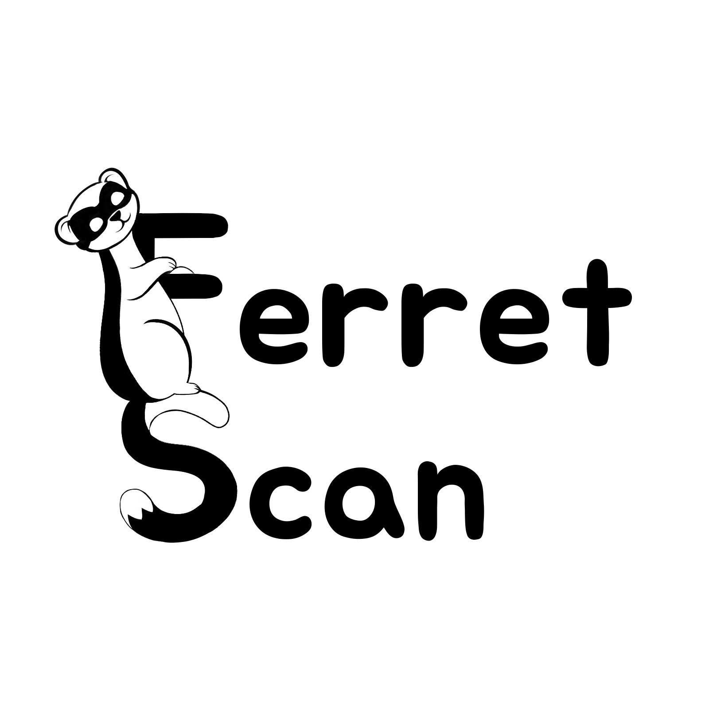
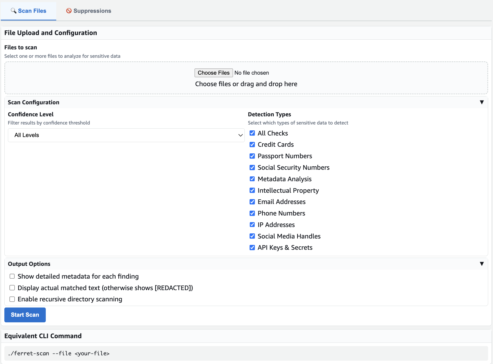
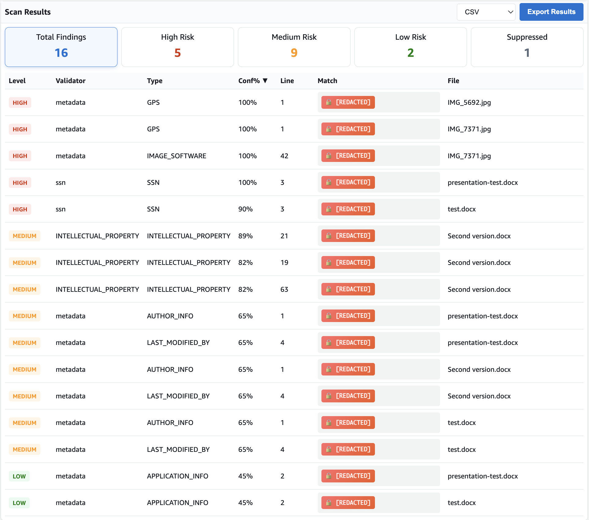

#  Ferret Scan

- [Ferret Scan](#ferret-scan)
  - [Installation](#installation)
  - [Features](#features)
  - [Building the Application](#building-the-application)
    - [Using the Makefile](#using-the-makefile)
    - [Manual Build](#manual-build)
  - [Usage](#usage)
    - [Command Line Options](#command-line-options)
    - [Examples](#examples)
  - [Confidence Levels](#confidence-levels)
  - [Supported Data Types](#supported-data-types)
  - [Adding New Validators](#adding-new-validators)
  - [Development Guidelines](#development-guidelines)

    - [Code Style](#code-style)

Ferret Scan is a sensitive data detection tool that scans files for potential sensitive information such as credit card numbers and passport numbers.

## Installation

### Quick Start (Recommended)

#### Linux/macOS
```bash
# macOS: Handle security for downloaded binary installation
chmod +x ferret-scan
xattr -d com.apple.quarantine ferret-scan

# System-wide installation (installs to /usr/local/bin/ferret-scan)
sudo scripts/install-system.sh

# Verify installation
ferret-scan --version

# Set up pre-commit integration (see docs/PRE_COMMIT_INTEGRATION.md)
pip install pre-commit
# Create .pre-commit-config.yaml with ferret-scan hook
```

**⚠️ macOS Security Note**: If macOS blocks execution with "cannot be opened because it is from an unidentified developer", run these commands on the downloaded binary BEFORE installation:
```bash
chmod +x ferret-scan
xattr -d com.apple.quarantine ferret-scan
```
Only use these commands for executables from trusted sources.

#### Windows
```powershell
# Run PowerShell as Administrator and install system-wide
.\scripts\install-system-windows.ps1

# Or install for current user only (no admin required)
.\scripts\install-system-windows.ps1 -UserInstall

# Verify installation
ferret-scan --version

# Set up pre-commit integration (see docs/PRE_COMMIT_INTEGRATION.md)
pip install pre-commit
# Create .pre-commit-config.yaml with ferret-scan hook
```

### Alternative Installation Methods

- **📦 [Release Installation](docs/INSTALL.md)** - Quick guide for release downloads
- **📖 [Complete Installation Guide](docs/INSTALLATION.md)** - Comprehensive installation options
- **🗑️ [Uninstallation Guide](docs/UNINSTALL.md)** - Complete removal instructions
- **🔧 Manual Installation**: Download from [GitLab Releases](https://code.aws.dev/personal_projects/alias_a/adifabio/Ferret-Scan/-/releases)
- **🏗️ Build from Source**: `make build` (see [Building the Application](#building-the-application))

## 📚 Documentation

Ferret Scan is extensively documented with comprehensive guides for users, developers, and operators:

**[📖 Complete Documentation Index →](docs/README.md)**

### Quick Links

- **🚀 Getting Started**: [Installation](#installation) | [Configuration Guide](docs/configuration.md) | [Architecture Overview](docs/architecture-diagram.md)
- **👥 User Guides**: [Web UI](docs/user-guides/README-WebUI.md) | [Docker](docs/user-guides/README-Docker.md) | [Preprocess-Only](docs/user-guides/README-Preprocess-Only.md) | [Suppressions](docs/user-guides/README-Suppressions.md)
- **🛠 Development**: [Creating Validators](docs/development/creating_validators.md) | [Testing Guide](docs/testing/TESTING.md)
- **🚀 Deployment**: [GitLab Integration](docs/GITLAB_INTEGRATION.md) | [GitLab Security Scanner Setup](docs/deployment/GITLAB_SECURITY_SCANNER_SETUP.md) | [CI/CD Setup](docs/deployment/GITLAB_CI_SETUP.md)

## Architecture

Ferret Scan uses a modular architecture with pluggable validators and preprocessors. For detailed architecture documentation and flow diagrams, see [docs/architecture-diagram.md](docs/architecture-diagram.md).

For application flow and processing diagrams, see [docs/ferret-application-flow.md](docs/ferret-application-flow.md).

For complete documentation, see the [Documentation Index](docs/README.md).

## Features

### Core Detection Capabilities

- **Email Address Validation**: RFC-compliant email detection with domain validation
- **Enhanced Credit Card Detection**: Mathematical validation with 15+ card brands, test pattern filtering, XML/HTML support, multiple separator formats (dashes, spaces, none), and improved quoted string handling
- **Intellectual Property Detection**: Patents, trademarks, copyrights, and trade secrets
- **Intelligent SSN Detection**: Domain-aware validation with HR/Tax/Healthcare context understanding
- **IP Address Detection**: IPv4 and IPv6 address identification with network context
- **Metadata Analysis**: EXIF and document metadata extraction and validation with intelligent file type filtering for improved performance
- **Advanced Passport Recognition**: Multi-country formats (US, UK, Canada, EU, MRZ) with travel context analysis
- **Person Name Detection**: Pattern matching with embedded name databases for first/last names, titles, and cultural variations
- **Phone Number Recognition**: International and domestic formats with country code support
- **Social Media Detection**: Configurable platform detection for handles, profiles, and usernames
- **Sophisticated Secrets Detection**: Entropy analysis + 40+ API key patterns (AWS, GitHub, Google Cloud, Stripe, etc.)

### Advanced Intelligence Features 🚀

- **Context-Aware Analysis**: Domain and document type understanding (Healthcare, Financial, HR, etc.)
- **Environment Detection**: Automatic dev/test/production environment recognition with confidence adjustments
- **Cross-Validator Signals**: Pattern correlation analysis across different validator types
- **Confidence Calibration**: Historical performance-based confidence scoring
- **Pattern Learning**: Automatic discovery of new patterns from operational feedback
- **Multi-Language Support**: Content validation in 9+ languages with locale-specific patterns

### Performance & Integration

- **Batch Processing**: Optimized parallel processing with worker pools and pattern caching
- **Memory Optimization**: Efficient resource management with memory pools and garbage collection
- **Real-Time Analytics**: Performance metrics, accuracy tracking, and predictive insights
- **Docker Support**: Containerized deployment for easy integration
- **CI/CD Integration**: Pre-commit hooks and pipeline integration
- **GitLab Security Scanner**: Native GitLab SAST report format for Security Dashboard integration
- **Web UI Interface**: Professional web interface with bulk operations and suppression management (use `ferret-scan --web`)

<!-- GENAI_DISABLED: AI-Powered Capabilities section
### AI-Powered Capabilities (GenAI)
- **AI-powered OCR**: Extract text from images and scanned documents using Amazon Textract
- **AI-powered Transcription**: Convert audio files to text using Amazon Transcribe
- **AI-powered PII Detection**: Detect sensitive information using Amazon Comprehend ML models
- **Cost Management**: Real-time cost estimation and selective service usage
-->

### Performance Optimizations

- **Intelligent File Type Filtering**: Metadata validator automatically skips plain text files that cannot contain meaningful metadata
- **Optimized Processing**: 20-30% performance improvement for workloads with many plain text files (.txt, .py, .js, .json, .md, etc.)
- **Smart Content Routing**: Only processes metadata extraction for files that actually contain metadata (images, documents, audio, video)
- **Reduced False Positives**: Eliminates false positives from analyzing plain text content as metadata

### Security & Compliance

- **Memory Scrubbing**: Secure memory handling to minimize sensitive data exposure
- **Suppression System**: Rule-based filtering to reduce false positives with bulk management
- **Confidence Scoring**: Multi-factor confidence calculation with context adjustments
- **Audit Trail**: Comprehensive logging and observability for compliance requirements

## Memory Security

Ferret Scan implements memory scrubbing to reduce the exposure of sensitive data in memory:

### How Memory Scrubbing Works

- **SecureString**: Sensitive data is stored in controlled byte slices instead of regular Go strings
- **Explicit Clearing**: Memory is overwritten with zeros using multiple passes after processing
- **Automatic Cleanup**: All matches are cleared from memory after output formatting
- **Reduced Exposure Window**: Minimizes the time sensitive data remains in memory

### Security Limitations

Due to Go language constraints, memory scrubbing provides **partial protection**:

- ✅ **Controlled clearing**: Byte slices are explicitly zeroed
- ✅ **Multiple overwrites**: Data is overwritten multiple times
- ✅ **Forced garbage collection**: Memory cleanup is triggered after processing
- ❌ **String immutability**: Go strings create temporary copies during processing
- ❌ **Compiler optimizations**: May eliminate "dead" memory overwrites
- ❌ **No memory locking**: Cannot prevent swapping to disk

### Memory Security Level: **MEDIUM**

The implementation provides better security than storing sensitive data in regular strings, but cannot guarantee complete memory protection due to Go's memory model.

### Usage

Memory scrubbing is automatically enabled and requires no additional configuration. Sensitive data is cleared from memory after each scan completes.

## Building the Application

### Development Setup

To set up your development environment:

```bash
# First, clone the repository
git clone https://code.aws.dev/personal_projects/alias_a/adifabio/Ferret-Scan.git
cd Ferret-Scan

# Make the setup script executable and run it
chmod +x scripts/setup-dev.sh
./scripts/setup-dev.sh
```

This script will:

- Install required Go tools (like golint)
- Add the Go bin directory to your PATH
- Install other dependencies

### Using the Makefile

The project includes a Makefile to simplify common development tasks:

```bash
# Build the application
make build

# Format code
make fmt

# Run linter
make lint

# Run go vet
make vet

# Clean build artifacts
make clean

# Run all checks and build
make all

# Install configuration file
make install-config
```

### Manual Build

If you prefer not to use the Makefile, you can build manually:

```bash
go build -ldflags="-s -w" -o ferret-scan cmd/main.go
```

## Usage

```bash
./ferret-scan --file <path-to-file> [options]
```

### Command Line Options

#### Core Options
- `--file`: Path to the input file, directory, or glob pattern (e.g., *.pdf) (required for CLI mode)
- `--config`: Path to configuration file (YAML)
- `--profile`: Profile name to use from config file
- `--list-profiles`: List available profiles in config file
- `--format`: Output format: "text", "json", "csv", "yaml", "junit", "gitlab-sast" (default: "text")
  - **gitlab-sast**: GitLab Security Report format for integration with GitLab Security Dashboard and merge request widgets
- `--confidence`: Confidence levels to display, comma-separated: "high", "medium", "low", or "all" (default: "all")
- `--checks`: Specific checks to run, comma-separated: "CREDIT_CARD", "EMAIL", "INTELLECTUAL_PROPERTY", "IP_ADDRESS", "METADATA", "PASSPORT", "PERSON_NAME", "PHONE", "SECRETS", "SOCIAL_MEDIA", "SSN"<!-- GENAI_DISABLED: , "COMPREHEND_PII" -->, or "all" (default: "all")
  - **SOCIAL_MEDIA**: Requires configuration - see [Social Media Configuration Guide](docs/social-media-configuration.md)

#### Output and Display Options
- `--verbose`: Display detailed information for each finding (default: false)
- `--debug`: Enable debug logging to show preprocessing and validation flow
- `--output`: Path to output file (if not specified, output to stdout)
- `--no-color`: Disable colored output (useful for logging or non-terminal output)
- `--show-match`: Display the actual matched text in findings (otherwise shows [HIDDEN])
- `--quiet`: Suppress progress output (useful for scripts and CI/CD)
- `--help`: Show help information
- `--version`: Show version information

#### File Processing Options
- `--enable-preprocessors`: Enable text extraction from documents (PDF, Office files) (default: true, use `--enable-preprocessors=false` to disable)
- `--preprocess-only`: Output preprocessed text and exit (no validation or redaction)
- `-p`: Short form of `--preprocess-only`
- `--recursive`: Recursively scan directories (default: false)

#### Redaction Options
- `--enable-redaction`: Enable redaction of sensitive data found in documents
- `--redaction-output-dir`: Directory where redacted files will be stored (default: "./redacted")
- `--redaction-strategy`: Default redaction strategy: "simple", "format_preserving", or "synthetic" (default: "format_preserving")
- `--redaction-audit-log`: Path to save redaction audit log file (JSON format for compliance)

#### Suppression Management
- `--generate-suppressions`: Generate suppression rules for all findings (disabled by default, updates last_seen_at for existing rules)
- `--suppression-file`: Path to suppression configuration file (default: ".ferret-scan-suppressions.yaml")
- `--show-suppressed`: Include suppressed findings in output with suppression details (marked as [SUPP] in text format)

#### Web Server Mode
- `--web`: Start web server mode instead of CLI scanning
- `--port`: Port for web server (default: 8080, only used with --web)


<!-- GENAI_DISABLED: GenAI command line options
#### GenAI Options (Currently Disabled)
- `--enable-genai`: Enable AI-powered text extraction using Amazon Textract OCR (requires AWS credentials, data sent to AWS, costs may apply)
- `--genai-services`: Comma-separated list of GenAI services to use: textract, transcribe, comprehend, or 'all' (default: all, only used with --enable-genai)
- `--textract-region`: AWS region for Textract service (default: us-east-1, only used with --enable-genai)
- `--transcribe-bucket`: S3 bucket name for Transcribe audio uploads (optional, creates temporary bucket if not specified)
- `--max-cost`: Maximum cost limit for GenAI services (default: no limit)
- `--estimate-only`: Show cost estimate and exit without processing
-->

### Examples

Scan a file and display all findings in text format:

```bash
./ferret-scan --file sample.txt
```

Scan a file and only show high confidence findings:

```bash
./ferret-scan --file sample.txt --confidence high
```

Scan a file and output results as JSON:

```bash
./ferret-scan --file sample.txt --format json
```

Generate GitLab Security Report for CI/CD integration:

```bash
./ferret-scan --file . --recursive --format gitlab-sast --output gl-sast-report.json
```

Scan a file and save results to an output file:

```bash
./ferret-scan --file sample.txt --format json --output results.json
```

Show detailed information for high and medium confidence findings:

```bash
./ferret-scan --file sample.txt --confidence high,medium --verbose
```

Use a configuration file:

```bash
./ferret-scan --file sample.txt --config ferret.yaml
```

Use a specific profile from the configuration file:

```bash
./ferret-scan --file sample.txt --config ferret.yaml --profile thorough
```

Scan for intellectual property (requires configuration):

```bash
./ferret-scan --file document.txt --config ferret.yaml --checks INTELLECTUAL_PROPERTY
```

Scan for social media profiles and handles (requires configuration):

```bash
./ferret-scan --file document.txt --checks SOCIAL_MEDIA
```

Start web server on default port (8080):

```bash
./ferret-scan --web
```

Start web server on custom port:

```bash
./ferret-scan --web --port 9000
```

**Note**: Social media detection requires configuration. See the [Social Media Configuration Guide](docs/social-media-configuration.md) for setup instructions.

List available profiles in the configuration file:

```bash
./ferret-scan --list-profiles --config ferret.yaml
```

### Text Extraction Examples

Extract preprocessed text from documents without validation:

```bash
./ferret-scan --file document.pdf --preprocess-only
```

Extract text using short form flag:

```bash
./ferret-scan --file document.docx -p
```

Extract text from multiple files:

```bash
./ferret-scan --file documents/ --recursive --preprocess-only
```

Extract text with verbose output showing processor details:

```bash
./ferret-scan --file image.jpg --preprocess-only --verbose
```

### Profile-Based Configuration Examples

Ferret Scan includes comprehensive pre-configured profiles for different use cases:

#### CI/CD Integration with JUnit Output

```bash
# Generate JUnit XML for test result integration
./ferret-scan --file . --recursive --config ferret.yaml --profile ci
```

#### Security Audit Scanning

```bash
# Security-focused scan excluding low confidence matches
./ferret-scan --file . --recursive --config ferret.yaml --profile security-audit
```

<!-- GENAI_DISABLED: Cost Estimation for GenAI Services example
#### Cost Estimation for GenAI Services
```bash
# Show cost estimates without processing (no AWS credentials needed)
./ferret-scan --file document.pdf --config ferret.yaml --profile cost-estimate
```
-->

#### Quick Development Scans

```bash
# Fast scan focusing on critical data types only
./ferret-scan --file . --config ferret.yaml --profile quick
```

#### Comprehensive Analysis

```bash
# Full analysis with all features and YAML output
./ferret-scan --file document.pdf --config ferret.yaml --profile comprehensive
```

#### Data Export Formats

```bash
```bash
# CSV format for spreadsheet analysis
./ferret-scan --file . --recursive --config ferret.yaml --profile csv-export

# JSON API format for programmatic processing
./ferret-scan --file document.txt --config ferret.yaml --profile json-api

# GitLab Security Scanner Integration
./ferret-scan --file . --recursive --config ferret.yaml --profile gitlab-security
```

<!-- GENAI_DISABLED: GenAI-Powered Analysis example
#### GenAI-Powered Analysis
```bash
# AI-powered scanning with cost controls (requires AWS credentials)
./ferret-scan --file scanned-document.pdf --config ferret.yaml --profile cost-aware-genai
```
-->

<!-- GENAI_DISABLED: Cost Management and Estimation examples
#### Cost Management and Estimation
```bash
# Show cost estimates without AWS credentials or processing
./ferret-scan --file document.pdf --config ferret.yaml --profile cost-estimate

# Set spending limits with command-line flags
./ferret-scan --file *.pdf --enable-genai --max-cost 5.00

# Profile-based cost control with built-in limits
./ferret-scan --file documents/ --recursive --config ferret.yaml --profile cost-aware-genai
```
-->

<!-- GENAI_DISABLED: Amazon Textract OCR examples
Use Amazon Textract OCR for advanced text extraction from images and scanned documents:
```bash
```bash
# WARNING: This will send files to AWS and incur costs (~$0.0015 per page/image)
./ferret-scan --file scanned-document.pdf --enable-genai
```

Use Textract with a specific AWS region:
```bash
./ferret-scan --file image.png --enable-genai --textract-region us-west-2
```

Use only specific GenAI services (to control costs):
```bash
# Use only Textract OCR, skip expensive Comprehend
./ferret-scan --file image.jpg --enable-genai --genai-services textract

# Use Textract and Transcribe, process with local validators
./ferret-scan --file audio.mp3 --enable-genai --genai-services textract,transcribe
```
-->

Quiet mode for scripts and CI/CD:

```bash
# Suppress progress output for clean script output
./ferret-scan --file document.txt --quiet

# Combine with other options for automated scanning
./ferret-scan --file *.pdf --quiet --format json --output results.json
```

Detect secrets and API keys:

```bash
# Scan for secrets in configuration files
./ferret-scan --file config.json --checks SECRETS

# High confidence secrets only
./ferret-scan --file .env --checks SECRETS --confidence high

# Verbose output with entropy analysis
./ferret-scan --file app.py --checks SECRETS --verbose
```

View suppressed findings:

```bash
# Show what findings were suppressed and why
./ferret-scan --file document.txt --format json --show-suppressed

# Regular scan (suppressed findings not shown)
./ferret-scan --file document.txt --format json
```

### Suppression Management

Generate suppression rules for findings to reduce false positives:

```bash
# Generate disabled suppression rules for all findings
./ferret-scan --file document.txt --generate-suppressions

# Run again to update last_seen_at timestamps
./ferret-scan --file document.txt --generate-suppressions

# Use custom suppression file
./ferret-scan --file document.txt --suppression-file custom-suppressions.yaml

# Default suppression file location
# ~/.ferret-scan/suppressions.yaml
```

**Web UI Management**: The web interface provides comprehensive suppression management:

- **View Rules**: Browse all suppression rules with file details and pagination
- **Bulk Operations**: Select multiple rules for enable/disable/delete operations
- **Individual Actions**: Enable, disable, edit, or remove single rules
- **Undo Support**: Undo button appears after operations to reverse changes
- **New Findings Integration**: Add suppressions directly from scan results
- **Auto-generation**: Rules created during scans with --generate-suppressions
- **CLI Compatibility**: Suppressions work seamlessly between web UI and command line

#### Bulk Operations and Undo

The web UI supports efficient bulk operations for managing multiple suppressions:

**Bulk Operations:**

```bash
# Select multiple suppressions using checkboxes
# Available bulk actions:
- Enable Selected: Activate multiple rules at once
- Disable Selected: Deactivate multiple rules at once
- Delete Selected: Permanently remove multiple rules
- Add Selected as Suppressions: Create rules from new scan findings
```

**Undo Functionality:**

- Undo button appears after any bulk or individual operation
- Reverses the last action (enable → disable, create → delete, etc.)
- Preserves original enabled/disabled state for deleted rules
- Works for both bulk and individual operations

**Selection Features:**

- Checkbox selection with "Select All" and "Clear" options
- Separate selection systems for existing rules vs new findings
- Visual indicators show selection count and available actions

For comprehensive suppression documentation, see [Suppression System Guide](docs/user-guides/README-Suppressions.md).

<!-- GENAI_DISABLED: For comprehensive GenAI documentation, see [GenAI Integration Guide](docs/development/genai_integration.md). -->

## Recent Changes and Behavior Updates

### Person Name Validator Optimization (2025)

The person name validator has been significantly optimized with database-first processing and enhanced accuracy:

**What Changed:**
- **Database-First Processing**: Names are checked against embedded databases before pattern matching
- **Early Exit Optimization**: Non-matching text exits immediately without expensive pattern matching
- **Enhanced Technical Context Detection**: Automatic confidence penalties for technical terms (API, function, method)
- **Comma-Separated Name Support**: New patterns for "Last, First" format detection
- **Confidence Bug Fixes**: Eliminated confidence leakage from zero-confidence matches

**User Impact:**
- **Dramatic Performance Improvement**: 98% faster processing with 12x throughput increase
- **Better Accuracy**: Reduced false positives in technical documentation
- **Enhanced Detection**: Support for additional name formats and patterns
- **Same Interface**: No configuration changes required

**No Configuration Required**: This optimization is automatic and maintains full backward compatibility.

### Metadata Validator File Type Filtering (2025)

The metadata validator now includes intelligent file type filtering that automatically determines which files can contain meaningful metadata:

**What Changed:**
- Plain text files (.txt, .py, .js, .json, .md, etc.) are automatically skipped during metadata validation
- Only files that can actually contain metadata (images, documents, audio, video) are processed
- Debug logging now shows file type filtering decisions

**User Impact:**
- **Faster Performance**: 20-30% improvement for workloads with many plain text files
- **Fewer False Positives**: Eliminates false matches from analyzing text content as metadata
- **Same Accuracy**: Full metadata detection maintained for files that actually contain metadata
- **Debug Output**: New debug messages show which files are processed vs skipped

**No Configuration Required**: This optimization is automatic and requires no changes to existing configurations or command-line usage.

## Additional Documentation

### User Guides

- [Configuration Guide](docs/configuration.md) - YAML configuration and profiles
- [Docker Guide](docs/user-guides/README-Docker.md) - Container deployment
- [Web UI Guide](docs/user-guides/README-WebUI.md) - Web interface documentation
- [Examples](examples/README.md) - Code examples and usage samples

### Development

- [Creating Validators](docs/development/creating_validators.md) - Developer guide
- [Debug Logging](docs/development/debug_logging.md) - Troubleshooting guide
- [Text Extraction Integration](docs/development/text_extraction_integration.md) - Document processing
<!-- GENAI_DISABLED: GenAI documentation links
- [GenAI Implementation Summary](docs/development/genai_implementation_summary.md) - Textract OCR implementation
- [Comprehend Implementation Summary](docs/development/comprehend_implementation_summary.md) - AI PII detection implementation
-->

### Reference

- [Battle Card](docs/battle-card.md) - Competitive analysis and positioning
- [Changelog](CHANGELOG.md) - Version history and updates

## Docker and CI/CD Integration

Ferret Scan is designed for seamless integration into modern development workflows.

### Container Support (Docker/Finch)

Run Ferret Scan in a containerized environment using Docker or Finch:

```bash
# Build container image (Docker or Finch)
# Build container image (auto-detects Docker/Finch)
make container-build

# Web UI mode with persistent data (recommended)
./scripts/container-run.sh -p 8080:8080 -v ~/.ferret-scan:/home/ferret/.ferret-scan ferret-scan

# CLI mode - basic scan
./scripts/container-run.sh --rm -v $(pwd):/data ferret-scan ferret-scan --file /data/document.txt

# CLI mode - with persistent configuration and suppressions
./scripts/container-run.sh --rm -v $(pwd):/data -v ~/.ferret-scan:/home/ferret/.ferret-scan ferret-scan ferret-scan --file /data/document.txt

# Or use container runtime directly (Docker/Finch):
# docker run -p 8080:8080 -v ~/.ferret-scan:/home/ferret/.ferret-scan ferret-scan
# finch run -p 8080:8080 -v ~/.ferret-scan:/home/ferret/.ferret-scan ferret-scan
```

See the [Container Guide](docs/user-guides/README-Docker.md) for detailed usage instructions.

**Volume Mapping:**

- `-v ~/.ferret-scan:/root/.ferret-scan` - Persist config and suppressions
- `-v $(pwd):/workspace` - Mount current directory for file access
- `-e FERRET_CONFIG_DIR=/config` - Override config directory location

### Pre-commit Integration

Integrate Ferret Scan directly into your Git workflow using pre-commit hooks:

#### Quick Team Setup (Recommended)

```bash
# Complete team setup in one command
make setup-team

# This configures:
# • Team security policies (.ferret-scan.yaml)
# • Pre-commit hooks (.pre-commit-config.yaml)  
# • GitHub Actions workflow (.github/workflows/ferret-scan.yml)

# Commit the configuration to share with your team
git add .ferret-scan.yaml .pre-commit-config.yaml .github/workflows/ferret-scan.yml
git commit -m "Add Ferret Scan team security configuration"
```

#### Developer Setup (Team Members)

```bash
# Each team member runs once:
make setup-developer

# This installs pre-commit hooks and tests the setup
# Commits will now be automatically scanned for sensitive data
```

#### Manual Setup Options

**Option 1: Python Package**

```bash
# Install via pip
# PyPi Package Coming Soon!!
```

```yaml
# .pre-commit-config.yaml
repos:
  - repo: https://github.com/awslabs/ferret-scan
    rev: v1.0.0
    hooks:
      - id: ferret-scan
        name: Ferret Scan - Sensitive Data Detection
        files: '\.(txt|py|js|json|yaml|md)$'
```

#### Option 2: Local Installation

```yaml
# .pre-commit-config.yaml (requires ferret-scan to be installed)
repos:
  - repo: local
    hooks:
      - id: ferret-scan
        name: Ferret Scan - Sensitive Data Detection
        entry: ferret-scan
        language: system
        files: '\.(txt|py|js|json|yaml|md)$'
        args: ['--file', '--quiet']
```

**Option 3: Direct Binary Integration**

```yaml
# .pre-commit-config.yaml (build from source)
repos:
  - repo: local
    hooks:
      - id: ferret-scan
        name: Ferret Scan - Direct Binary
        entry: go run cmd/main.go --pre-commit-mode
        language: system
        files: '\.(txt|py|js|json|yaml|md)$'
        pass_filenames: true
```

### CI/CD Pipeline Integration

**GitLab CI/CD:**

```yaml
# .gitlab-ci.yml
security-scan:
  stage: security
  image: ferret-scan:latest
  script:
    - ferret-scan --file . --recursive --format json --output scan-results.json
  artifacts:
    reports:
      junit: junit-report.xml
    paths:
      - scan-results.json
    expire_in: 1 week
  rules:
    - if: $CI_PIPELINE_SOURCE == "merge_request_event"
    - if: $CI_COMMIT_BRANCH == $CI_DEFAULT_BRANCH
```

**Jenkins Pipeline:**

```groovy
pipeline {
    agent any
    stages {
        stage('Security Scan') {
            steps {
                sh 'ferret-scan --file . --recursive --confidence high --format json --output results.json'
                archiveArtifacts artifacts: 'results.json'
            }
        }
    }
}
```

## Web UI Interface

Ferret Scan includes a web-based interface for easy file scanning through your browser.

### Quick Start

```bash
# Build and start the web UI
make build
./bin/ferret-scan --web --port 8080
```

Then open http://localhost:8080 in your browser (or the port you specified).

### Interface Screenshots

**Main Interface - File Upload and Configuration**


**Scan Results - Interactive Results Table**


### Web UI Features

#### Version Information

- **Display**: Version number shown in top navigation bar
- **Details**: Click version number for detailed build information
- **API**: Complete version data available via `/health` endpoint
- **Timestamp**: Uses current server timestamp for real-time information

#### File Upload

- **Single File**: Click "Choose Files" and select one file
- **Multiple Files**: Hold Ctrl/Cmd while selecting files, or drag multiple files onto the upload area
- **Real-time Processing**: Results appear progressively as each file is scanned
- **Visual Progress Bar**: Shows completion percentage and current file being processed
- **Progress Tracking**: Shows current file being processed (e.g., "Scanning file 2 of 5: document.pdf")

#### Scan Configuration

- **Confidence Levels**: Filter results by HIGH, MEDIUM, LOW, or all levels
- **Check Types**: Select specific validators or run all checks
- **Verbose Output**: Show detailed information for each finding
- **Recursive Scanning**: Process directories recursively (when applicable)
<!-- GENAI_DISABLED: - **GenAI Features**: Enable AI-powered text extraction and PII detection -->

<!-- GENAI_DISABLED: GenAI Options section
#### GenAI Options
- **Amazon Textract OCR**: Extract text from images and scanned documents (~$0.0015 per page)
- **Amazon Transcribe**: Convert audio files to text for analysis (~$0.024 per minute)
- **Amazon Comprehend PII**: AI-powered PII detection (could be expensive, ~$0.0001 per 100 characters)
- **Selective Service Usage**: Choose specific AWS services to control costs
- **AWS Region Selection**: Choose optimal region for GenAI services
- **Real-time Cost Estimates**: Accurate cost calculation based on selected services and file types
- **Cost Warning**: Clear indication of AWS charges and data transmission
-->

#### Results Display

- **Real-time Updates**: Results appear as each file completes processing
- **Smart Sorting**: Default multi-level sort by confidence (desc), filename (asc), line number (asc)
- **Interactive Pagination**: Navigate large result sets with clickable page numbers (50/100 per page or all)
- **Clickable Statistics**: Filter results by confidence level using stat cards
- **Suppressed Findings**: Click "Suppressed" stat card to view detailed modal of suppressed findings with rule information
- **Color Coding**: Visual distinction between confidence levels
- **Detailed Information**: File location, line numbers, confidence scores, and metadata
- **Export Options**: Download results as CSV or JSON with current display settings
- **Error Handling**: Individual file errors don't stop processing of other files

#### Suppression Management

- **Bulk Operations**: Select multiple suppressions using checkboxes for batch enable/disable/delete
- **Individual Actions**: Quick enable/disable/edit/remove buttons for single rules
- **Undo Functionality**: Undo button appears after operations to reverse the last change
- **New Findings Integration**: Scan results show new findings that can be added as suppressions
- **Rule Details**: Click rule IDs to view complete suppression information
- **Status Indicators**: Visual ENABLED (green) and DISABLED (red) status badges
- **Smart Pagination**: Navigate large suppression rule sets efficiently

### Supported File Types

The web UI supports all file types available in the CLI version:

#### Text Files

- Plain text (.txt, .log, .csv, .json, .xml, etc.)
- Source code files (.py, .js, .java, .cpp, etc.)
- Configuration files (.yaml, .ini, .conf, etc.)

**Note**: The metadata validator automatically skips these file types as they cannot contain meaningful metadata, improving performance by 20-30% for workloads with many plain text files.

#### Documents (with preprocessing)

- PDF documents (.pdf)
- Microsoft Office (.docx, .xlsx, .pptx)
- OpenDocument (.odt, .ods, .odp)

#### Images (with metadata extraction)

- JPEG (.jpg, .jpeg) - EXIF metadata, GPS coordinates
- PNG (.png) - Image metadata and properties
- GIF (.gif) - Animation and metadata
- BMP (.bmp) - Basic image metadata
- TIFF (.tiff, .tif) - Comprehensive metadata
- WebP (.webp) - Modern format metadata

**Note**: The metadata validator automatically processes these file types for metadata extraction.

#### Audio Files (with metadata extraction)

- MP3 (.mp3) - ID3v1/v2 tags, artist, album, lyrics
- M4A (.m4a) - iTunes metadata, AAC format
- WAV (.wav) - RIFF chunks, broadcast metadata
- FLAC (.flac) - Vorbis comments, lossless metadata
- OGG (.ogg) - Vorbis comments, stream info

**Note**: The metadata validator automatically processes these file types for metadata extraction.

#### Video Files (with metadata extraction)

- MP4 (.mp4) - MP4 atoms, iTunes metadata, codec info
- MOV (.mov) - QuickTime atoms, metadata
- AVI (.avi) - RIFF chunks, stream metadata
- MKV (.mkv) - Matroska elements, tags
- WMV (.wmv) - ASF headers, Windows Media metadata

**Note**: The metadata validator automatically processes these file types for metadata extraction.

### Security Features

- **Local Processing**: All scanning happens on your machine
- **Temporary Files**: Uploaded files are automatically deleted after scanning
- **No Data Storage**: Results are not saved permanently on the server
- **Memory Scrubbing**: Sensitive data is cleared from memory after processing
<!-- GENAI_DISABLED: - **GenAI Warnings**: Clear notifications when data will be sent to AWS services -->

### Configuration Examples

#### Basic Document Scan

1. Upload: `contract.pdf`
2. Confidence: "High & Medium"
3. Checks: "All Checks"
4. Click "Scan File"

<!-- GENAI_DISABLED: AI-Powered Image Analysis example
#### AI-Powered Image Analysis
1. Upload: `scanned-document.jpg`
2. Enable: "Enable GenAI"
3. Region: "us-east-1"
4. Checks: "All Checks"
5. Click "Scan File"
-->

#### Bulk File Processing

1. Select multiple files (Ctrl+click or drag multiple)
2. Configure desired settings
3. Watch real-time progress as each file is processed
4. View accumulated results sorted by severity

#### Suppression Management

1. **View Suppressions**: Click "Suppressions" tab to manage rules
2. **Bulk Operations**: Select multiple rules with checkboxes, then use bulk action buttons
3. **Individual Actions**: Use enable/disable/edit/remove buttons on each rule
4. **Undo Changes**: Click "Undo Last Change" button to reverse operations
5. **Add from Scan**: New findings from scans can be directly added as suppressions

### Technical Details

#### Port Management

- Default port: 8080
- Auto-increment: If 8080 is busy, tries 8081, 8082, etc.
- Custom port: Set `PORT` environment variable

#### File Size Limits

- Maximum upload: 10MB per file
<!-- GENAI_DISABLED: - Audio files: 500MB limit (for GenAI transcription) -->
- Multiple files: No limit on total count

#### Performance

- Sequential processing: Files are scanned one at a time for stability
- Smart pagination: Only shows pagination controls when needed (50+ results)
- Progress feedback: Visual progress bar with real-time updates
- Error isolation: Problems with one file don't affect others
- Memory efficient: Results are paginated to handle large datasets

### Troubleshooting

#### "ferret-scan binary not found"

```bash
# Build the main binary first
make build
# Then start web UI
./bin/ferret-scan --web --port 8080
```

#### Port already in use

The web UI automatically finds an available port. Check the console output for the actual port being used.

<!-- GENAI_DISABLED: GenAI troubleshooting section
#### GenAI features not working
1. Ensure AWS credentials are configured
2. Check internet connectivity
3. Verify IAM permissions for Textract/Comprehend/Transcribe
4. Confirm selected AWS region supports the services
-->

#### Large file uploads failing

- Check file size limits (10MB for most files, 500MB for audio)
<!-- GENAI_DISABLED: - Ensure stable internet connection for GenAI features -->
- Try processing files individually if bulk upload fails

### Development

#### Manual Setup

```bash
# Build main binary
make build

# Start web server
./bin/ferret-scan --web --port 8080

# Or run directly
./bin/ferret-scan --web --port 8080
```

#### Customization

- Modify `internal/web/server.go` to add features
- Update HTML template in `web/template.html` for UI changes
- Adjust file size limits or add new scan options

#### API Endpoint

The web UI exposes a REST API at `/scan` that accepts multipart form data with the same parameters as the web interface.

#### User Interface Enhancements

- **CloudScape Design**: AWS Console-style interface with professional styling
- **Responsive Layout**: Works on desktop and mobile devices
- **Interactive Help**: Comprehensive help modal with usage tips and examples
- **CLI Command Display**: Shows equivalent command-line usage based on current settings
- **Smart Pagination**: Page numbers with Previous/Next navigation
- **Sortable Columns**: Click any column header to sort results
- **Expandable Sections**: Collapsible configuration sections for clean interface

<!-- GENAI_DISABLED: AI-Powered Text Extraction (GenAI) section
## AI-Powered Text Extraction (GenAI)

Ferret Scan supports advanced AI-powered capabilities using Amazon Web Services. These features are enabled with the `--enable-genai` flag and include:

- **Amazon Textract OCR**: Extract text from images and scanned documents
- **Amazon Transcribe**: Convert audio files to text for sensitive data detection
- **Amazon Comprehend PII**: Detect personally identifiable information using ML models

### ⚠️ Important GenAI Considerations

- **Data Transmission**: Your files/text will be sent to AWS services (Textract, Comprehend) for processing
- **AWS Costs**: Textract ~$0.0015 per page/image, Comprehend ~$0.0001 per 100 characters
- **AWS Credentials Required**: You must have valid AWS credentials configured
- **Internet Connection**: Requires internet access to AWS services
- **Supported Regions**: Services available in specific AWS regions (default: us-east-1)

### GenAI Prerequisites

1. **AWS Account**: Active AWS account with billing enabled
2. **AWS Credentials**: Configure using one of these methods:
   - AWS CLI: `aws configure`
   - Environment variables: `AWS_ACCESS_KEY_ID` and `AWS_SECRET_ACCESS_KEY`
   - IAM roles (for EC2 instances)
   - AWS credentials file
   - **Recommended**: Use the provided IAM role (see below)
3. **IAM Permissions**: Your credentials need:
   - `textract:DetectDocumentText` (for OCR)
   - `transcribe:StartTranscriptionJob`, `transcribe:GetTranscriptionJob`, `transcribe:DeleteTranscriptionJob` (for audio)
   - `s3:PutObject`, `s3:DeleteObject`, `s3:CreateBucket`, `s3:DeleteBucket`, `s3:ListAllMyBuckets`, `s3:GetBucketLocation` (for Transcribe)
   - `comprehend:DetectPiiEntities` (for PII detection)
4. **Supported File Types**: PDF, PNG, JPEG, TIFF images (Textract), MP3, WAV, M4A, FLAC audio (Transcribe), any text content (Comprehend)

### Using the Provided IAM Role (Recommended)

For security and convenience, use the provided CloudFormation template to create a dedicated IAM role:

1. **Deploy the IAM role**:
```bash
aws cloudformation deploy --template-file aws-iam-role.yaml --stack-name ferret-scan-iam --capabilities CAPABILITY_NAMED_IAM --parameter-overrides ExternalId=your-secret-external-id
```

2. **Get the role ARN**:
```bash
aws cloudformation describe-stacks --stack-name ferret-scan-iam --query 'Stacks[0].Outputs[?OutputKey==`RoleArn`].OutputValue' --output text
```

3. **Assume the role before using GenAI features**:
```bash
# Assume the role
aws sts assume-role --role-arn arn:aws:iam::YOUR-ACCOUNT:role/FerretScanGenAIRole --role-session-name ferret-scan-session --external-id your-secret-external-id

# Export the temporary credentials (replace with actual values from above command)
export AWS_ACCESS_KEY_ID=ASIA...
export AWS_SECRET_ACCESS_KEY=...
export AWS_SESSION_TOKEN=...

# Now use GenAI features
./ferret-scan --file document.pdf --enable-genai
```

4. **Alternative: Create a profile**:
```bash
# Add to ~/.aws/config
[profile ferret-genai]
role_arn = arn:aws:iam::YOUR-ACCOUNT:role/FerretScanGenAIRole
source_profile = default
external_id = your-secret-external-id

# Use the profile
AWS_PROFILE=ferret-genai ./ferret-scan --file document.pdf --enable-genai
```

### GenAI Usage Examples

```bash
# Extract text from a scanned PDF using Textract
./ferret-scan --file scanned-document.pdf --enable-genai

# Process images with OCR
./ferret-scan --file screenshot.png --enable-genai

# Transcribe audio files
./ferret-scan --file audio.mp3 --enable-genai

# Use specific AWS region
./ferret-scan --file document.pdf --enable-genai --textract-region eu-west-1

# Transcribe audio with custom S3 bucket
./ferret-scan --file audio.mp3 --enable-genai --transcribe-bucket my-bucket

# AI-powered PII detection
./ferret-scan --file document.txt --enable-genai --checks COMPREHEND_PII

# Combine with other options
./ferret-scan --file *.pdf --enable-genai --format json --confidence high
```
-->

## File Locations

Ferret Scan uses a standard directory structure for configuration and data files:

```
~/.ferret-scan/
├── config.yaml        # Main configuration file
└── suppressions.yaml  # Suppression rules
```

**Environment Variables:**

- `FERRET_CONFIG_DIR`: Override the base directory (default: `~/.ferret-scan`)

## Configuration File Support

Ferret Scan supports YAML configuration files to set default options and create profiles for different scanning scenarios. This allows you to save commonly used settings and quickly switch between different scanning configurations.

For detailed configuration documentation, see [Configuration Guide](docs/configuration.md).

### Available Profiles Quick Reference

| Profile                 | Purpose                | Output Format | Use Case                          |
| ----------------------- | ---------------------- | ------------- | --------------------------------- |
| `quick`                 | Fast security check    | Text          | Development, pre-commit hooks     |
| `ci`                    | CI/CD integration      | JUnit XML     | Automated testing pipelines       |
| `security-audit`        | Security team scanning | JSON          | Compliance, security audits       |
| `comprehensive`         | Complete analysis      | YAML          | Forensic investigation, debugging |
| `csv-export`            | Data analysis          | CSV           | Spreadsheet analysis, reporting   |
| `json-api`              | API integration        | JSON          | Programmatic processing           |
| `debug`                 | Troubleshooting        | YAML          | Validator development, debugging  |
| `silent`                | Automation             | JSON          | Scripts, monitoring systems       |
| `credit-card`           | Payment security       | Text          | PCI compliance                    |
| `passport`              | Travel documents       | Text          | Identity verification             |
| `intellectual-property` | IP protection          | Text          | Corporate security                |

### Configuration File Locations

The tool looks for configuration files in the following locations (in order of precedence):

1. Path specified with `--config` flag
2. `config.yaml` in the current directory
3. `ferret.yaml` or `ferret.yml` in the current directory
4. `~/.ferret-scan/config.yaml` (standard location)
5. `.ferret.yaml` or `.ferret.yml` in the user's home directory (legacy)

### Configuration File Structure

The configuration file has three main sections:

- `defaults`: Default settings applied when no profile is specified
- `validators`: Global validator-specific configurations
- `profiles`: Named profiles for different scanning scenarios

Example configuration file:

```yaml
# Default settings applied when no profile is specified
defaults:
  format: text                # Output format: text or json
  confidence_levels: all      # Confidence levels to display: high, medium, low, or combinations
  checks: all                 # Specific checks to run: CREDIT_CARD, EMAIL, INTELLECTUAL_PROPERTY, IP_ADDRESS, METADATA, PASSPORT, PERSON_NAME, PHONE, SECRETS, SOCIAL_MEDIA, SSN, or combinations
  verbose: false              # Display detailed information for each finding
  no_color: false             # Disable colored output
  recursive: false            # Recursively scan directories

# Validator-specific configurations
validators:
  # Intellectual property validator configuration
  intellectual_property:
    # Internal company URL patterns to detect
    internal_urls:
      - "http[s]?:\\/\\/s3\\.amazonaws\\.com"
      - "http[s]?:\\/\\/.*\\.internal\\..*"
      - "http[s]?:\\/\\/.*\\.corp\\..*"
      - "http[s]?:\\/\\/.*-internal\\..*"

    # Custom intellectual property patterns
    intellectual_property_patterns:
      patent: "\\b(US|EP|JP|CN|WO)[ -]?(\\d{1,3}[,.]?\\d{3}[,.]?\\d{3}|\\d{1,3}[,.]?\\d{3}[,.]?\\d{2}[A-Z]\\d?)\\b"
      trademark: "\\b(\\w+\\s*[™®]|\\w+\\s*\\(TM\\)|\\w+\\s*\\(R\\)|\\w+\\s+Trademark|\\w+\\s+Registered\\s+Trademark)\\b"
      copyright: "(©|\\(c\\)|\\(C\\)|Copyright|\\bCopyright\\b)\\s*\\d{4}[-,]?(\\d{4})?\\s+[A-Za-z0-9\\s\\.,]+"
      trade_secret: "\\b(Confidential|Trade\\s+Secret|Proprietary|Company\\s+Confidential|Internal\\s+Use\\s+Only|Restricted|Classified)\\b"

# Profiles for different scanning scenarios
profiles:
  # Quick scan profile - only high confidence matches, minimal output
  quick:
    format: text
    confidence_levels: high
    checks: all
    verbose: false
    no_color: false
    recursive: false
    description: "Quick scan with only high confidence matches"

  # Thorough scan profile - all confidence levels, verbose output, recursive scanning
  thorough:
    format: text
    confidence_levels: all
    checks: all
    verbose: true
    no_color: false
    recursive: true
    description: "Thorough scan with all confidence levels and recursive scanning"

  # Company-specific profile with custom internal URLs and patterns
  company-specific:
    format: text
    confidence_levels: all
    checks: INTELLECTUAL_PROPERTY
    verbose: true
    no_color: false
    recursive: true
    description: "Company-specific intellectual property scan"
    validators:
      intellectual_property:
        # Company-specific internal URL patterns
        internal_urls:
          - "http[s]?:\\/\\/company-wiki\\.internal"
          - "http[s]?:\\/\\/docs\\.company\\.com"
          - "http[s]?:\\/\\/.*\\.company-internal\\.com"
```

### Command Line Priority

Command line options take precedence over configuration file settings. The order of precedence is:
1. Command line options
2. Profile settings (if a profile is specified)
3. Default settings from the configuration file
4. Built-in default values

## Confidence Levels

- **HIGH** (90-100%): Very likely to be sensitive data
- **MEDIUM** (60-89%): Possibly sensitive data
- **LOW** (0-59%): Likely not sensitive data or false positive

## Supported Data Types

Ferret Scan includes multiple validators for different types of sensitive data:

- [Credit Card Validator](internal/validators/creditcard/README.md) - Detects credit card numbers from major providers with advanced mathematical validation
- [Passport Validator](internal/validators/passport/README.md) - Detects passport numbers from various countries with contextual analysis
- [SSN Validator](internal/validators/ssn/README.md) - Detects Social Security Numbers with domain-aware validation
- [IP Address Validator](internal/validators/ipaddress/README.md) - Detects IP addresses with sensitivity filtering (excludes private, reserved, test ranges)
- [Email Validator](internal/validators/email/README.md) - Detects email addresses with advanced domain validation
- [Phone Validator](internal/validators/phone/README.md) - Detects phone numbers with international format support
- [Secrets Validator](internal/validators/secrets/README.md) - Detects API keys, tokens, passwords, and other secrets using entropy analysis
- [Social Media Validator](internal/validators/socialmedia/README.md) - Detects social media profiles, usernames, and handles across major platforms (LinkedIn, Twitter/X, Facebook, GitHub, Instagram, YouTube, TikTok, etc.)
- [Intellectual Property Validator](internal/validators/intellectualproperty/README.md) - Detects patents, trademarks, copyrights, and trade secrets
- [🆕 Enhanced Metadata Validator](internal/validators/metadata/README.md) - Preprocessor-aware metadata validation with intelligent file type filtering and type-specific patterns
<!-- GENAI_DISABLED: - [Comprehend PII Validator](internal/validators/comprehend/README.md) - AI-powered PII detection using Amazon Comprehend (GenAI mode) -->

For details on each validator's capabilities, supported formats, and detection methods, please refer to their individual documentation.

### Enhanced Metadata Processing Architecture (2025)

The metadata validator now features intelligent file type filtering and a sophisticated dual-path routing system with preprocessor-aware validation:

#### Intelligent File Type Filtering

The metadata validator automatically determines which files can contain meaningful metadata and skips processing of plain text files:

**Files Processed for Metadata:**
- **Images**: .jpg, .jpeg, .png, .gif, .tiff, .tif, .bmp, .webp, .heic, .heif, .raw, .cr2, .nef, .arw
- **Documents**: .pdf, .docx, .doc, .xlsx, .xls, .pptx, .ppt, .odt, .ods, .odp
- **Audio**: .mp3, .flac, .wav, .ogg, .m4a, .aac, .wma, .opus
- **Video**: .mp4, .mov, .avi, .mkv, .wmv, .flv, .webm, .m4v, .3gp, .ogv

**Files Skipped for Metadata (Performance Optimization):**
- **Plain Text**: .txt, .md, .log, .csv, .json, .xml, .html, .js, .py, .go, .java, .c, .cpp, .h, .sh, .bat, .ps1, .yaml, .yml
- **Source Code**: All programming language files and configuration files
- **Unknown Extensions**: Files without extensions or unrecognized file types

**Performance Benefits:**
- 20-30% faster processing for workloads with many plain text files
- Eliminates false positives from analyzing text content as metadata
- Reduced memory usage and CPU consumption
- Maintains full accuracy for files that actually contain metadata

#### Supported Metadata Types

- **Image Metadata**: EXIF data, GPS coordinates, camera information, creator details
  - **File Types**: JPG, JPEG, TIFF, TIF, PNG, GIF, BMP, WEBP
  - **Enhanced Detection**: GPS data (+60% confidence), device info (+40%), creator info (+30%)
- **Document Metadata**: Author information, document properties, rights data
  - **File Types**: PDF, DOCX, XLSX, PPTX, ODT, ODS, ODP
  - **Enhanced Detection**: Manager info (+40% confidence), comments (+50%), author info (+30%)
- **Audio Metadata**: Artist information, contact details, recording data
  - **File Types**: MP3, FLAC, WAV, M4A
  - **Enhanced Detection**: Contact info (+50% confidence), management (+40%), artist info (+30%)
- **Video Metadata**: Location data, device information, production details
  - **File Types**: MP4, MOV, M4V
  - **Enhanced Detection**: GPS data (+60% confidence), location info (+50%), device info (+40%)

#### Architecture Benefits

- **Improved Accuracy**: 20-30% improvement in precision through targeted validation
- **Reduced False Positives**: 40-50% reduction through preprocessor-aware patterns
- **Enhanced Performance**: 5-15% faster processing through intelligent content routing
- **Better Debugging**: Detailed observability into validation decisions and confidence scoring

#### Usage Examples

```bash
# Enhanced metadata validation with debug output (shows file type filtering decisions)
ferret-scan --file photo.jpg --checks METADATA --debug --verbose

# Scan multiple metadata types with high confidence (automatically skips .txt, .py, .js files)
ferret-scan --file media/ --recursive --checks METADATA --confidence high

# Use enhanced metadata profile with detailed output (shows which files are processed vs skipped)
ferret-scan --config ferret.yaml --profile enhanced-metadata --file documents/

# Example showing file type filtering in action
ferret-scan --file mixed-folder/ --recursive --checks METADATA --debug
# Output will show: "Skipping metadata validation for file.txt (plain text file type)"
# Output will show: "Processing metadata for photo.jpg (image file type)"
```

### Enhanced False Positive Prevention

All validators implement advanced false positive prevention:

- **Zero Confidence Filtering**: Automatically excludes matches with 0% confidence scores
- **Context-Aware Analysis**: Uses surrounding text and keywords to improve accuracy
- **Pattern Validation**: Mathematical and structural validation for applicable data types
- **Sensitivity Filtering**: IP Address validator excludes non-identifying addresses (private, reserved, test ranges)
- **Test Data Detection**: Identifies and filters common test patterns and placeholder data

**Web UI Access**: All validators are available through the web interface at http://localhost:8080 after running `ferret-scan --web` (or specify a custom port with `--port <number>`).

## Adding New Validators

To add a new validator for detecting other types of sensitive data:

1. Create a new package under `internal/validators/`
2. Implement the `detector.Validator` interface
3. Add your validator to the list in `cmd/main.go`
4. Create a README.md in your validator's package directory with:
   - Description of what the validator detects
   - Supported formats or types
   - Detection capabilities and features
   - Confidence scoring methodology
   - Usage examples
   - Implementation details
5. Add a link to your validator's README in the main README.md

See the existing validator READMEs for examples of the recommended documentation structure.

## Development Guidelines

### Code Style

1. Format code with `make fmt` before committing
2. Run `make vet` and `make lint` to check for common issues
3. Follow Go's standard naming conventions and code organization

## Support

For questions, issues, or contributions:

- **Developers**: Andrea Di Fabio (adifabio@), Lee Myers (mlmyers@)
- **Artwork**: Original logo artwork by Olivia Myers McMullin

## License
Copyright Amazon.com, Inc. or its affiliates. All Rights Reserved.
SPDX-License-Identifier: Apache-2.0
