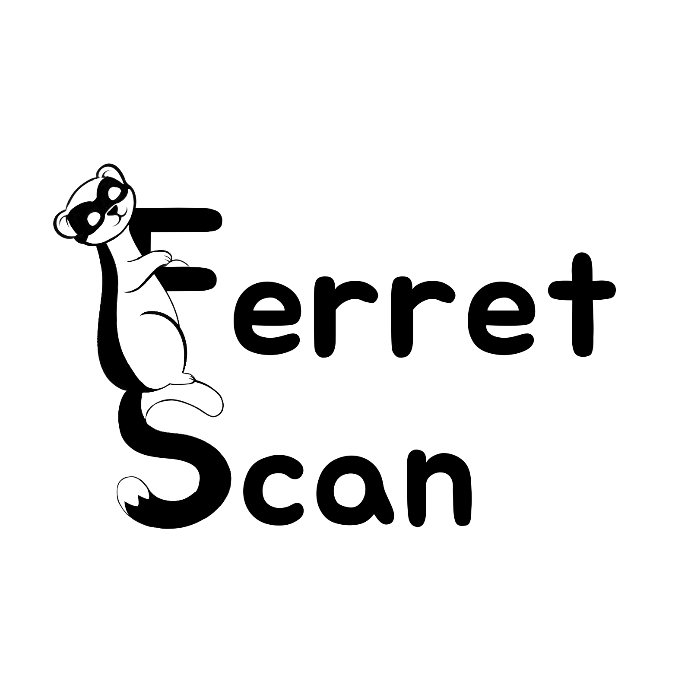
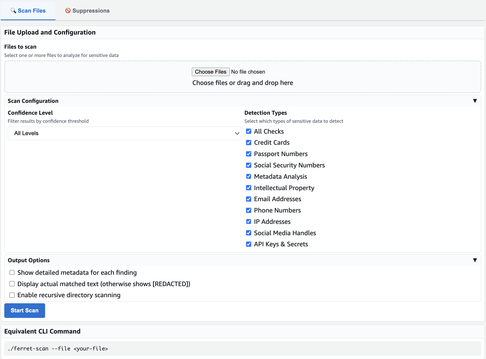
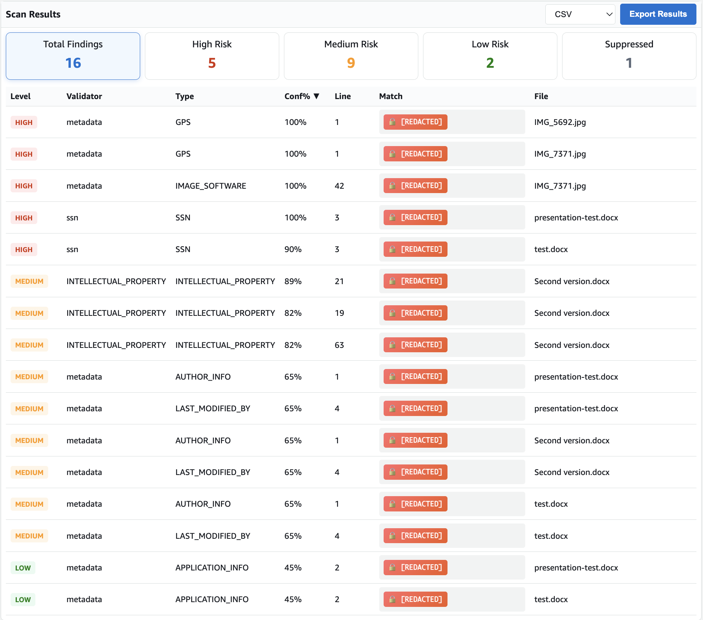

# ferret-scan

<p align="center">
  
</p>

**Find and redact sensitive data before it leaks.** A single-binary Go CLI (plus embedded web UI and Go library — `pkg/scan` for detection, `pkg/redact` for redaction) that detects PII, secrets, and IP markers in your files and streams — then redacts them in place, format-preserving, with context-aware confidence scoring. No runtime dependencies. No data leaves your host.

[](LICENSE.txt)
[](go.mod)
[](https://pypi.org/project/ferret-scan/)
[](https://github.com/awslabs/ferret-scan#install)
[](https://gallery.ecr.aws/awslabs/ferret-scan)
[](https://github.com/awslabs/ferret-scan)



---

A customer SSN pasted into a log line. An AWS access key committed in a diff. A support transcript archived to S3. A PDF with EXIF metadata attached to a ticket. Sensitive data leaks through the seams between systems — and once it lands in a log store or an object bucket, it is expensive to get back out. **ferret-scan is the control you put in front of those seams:** it finds the sensitive values, scores how likely each one is real, and redacts them so the rest of the data keeps flowing.

---

## Try it in 30 seconds

```bash
# 1. Install
pip install ferret-scan

# 2. Scan a file (values are HIDDEN by default — findings are safe to share)
ferret-scan --file secrets.env

# 3. Redact a stream in one pipe (redacted text -> stdout, findings -> stderr)
echo "card 5500-0000-0000-0004 from jordan@example.com" \
  | ferret-scan --stdin --enable-redaction
```

That last command turns sensitive values into masked-but-shaped output:

| Before | After (`--enable-redaction`) |
|---|---|
| `card 5500-0000-0000-0004 from jordan@example.com` | `card ****-****-****-0004 from j*****@example.com` |

Sensitive values are masked while the shape of the data survives — so downstream tooling, tests, and log pipelines keep working. (Examples here use reserved documentation values.)

---

## Why ferret-scan

- **Confidence you can act on.** Scoring is context-aware, not just regex. A credit card in a financial document scores higher than the same digits in a test fixture, because the engine re-weights on document type and surrounding domain. Findings land in three bands: **HIGH (90–100)**, **MEDIUM (60–89)**, **LOW (0–59)**.
- **Redaction that composes.** The stdin gateway streams redacted bytes to stdout and findings to stderr, so it drops into any Unix pipe or CI step. Three strategies: `simple`, `format_preserving` (default), and `synthetic` (realistic fakes for building test datasets).
- **Explainable, offline.** `--explain` attaches a plain-language rationale, a verdict (`likely_real` / `likely_test` / `uncertain`), and a drafted suppression reason to every finding. Fully deterministic — no network, no LLM.
- **Ships everywhere.** One static binary, no runtime deps, a `scratch`-based Docker image (~5–10 MB), a `pip` package, a Homebrew tap, a pre-commit hook, and a stable Go library (`pkg/scan` + `pkg/redact`).
- **Safe by design.** Matched values are hidden unless you pass `--show-match`. In-memory redaction produces payload-free audit records. The web UI binds to `127.0.0.1` with CSRF and CSP protections.

---

## Install

Pick whichever fits your workflow — all are first-class.

| Method | Command |
|---|---|
| **Homebrew** (macOS/Linux) | `brew tap awslabs/ferret-scan https://github.com/awslabs/ferret-scan && brew install awslabs/ferret-scan/ferret-scan` |
| **pip** (CLI + pre-commit) | `pip install ferret-scan` |
| **Docker** | `docker pull public.ecr.aws/awslabs/ferret-scan:latest` |
| **From source** (Go 1.26.5) | `git clone https://github.com/awslabs/ferret-scan.git && cd ferret-scan && go build ./cmd` |

Docker one-liner (mount the current directory and scan it):

```bash
docker run --rm -v "$PWD:/data" public.ecr.aws/awslabs/ferret-scan:latest --file /data --recursive
```

---

## What it detects

Thirteen validators, each purpose-built. Enable a subset with `--checks CREDIT_CARD,SECRETS,SSN` or run them all (the default).

| Validator | What it catches | Notes |
|---|---|---|
| `CREDIT_CARD` | Card numbers across 15+ brands | Luhn-validated; emits `VISA`, `MASTERCARD`, `AMERICAN_EXPRESS`, …; filters known test patterns |
| `SECRETS` | API keys, tokens, credentials | Entropy analysis + 40+ patterns (AWS keys, GitHub tokens, Stripe, …) |
| `SSN` | US Social Security Numbers | Domain-aware (HR / Tax / Healthcare context) |
| `EMAIL` | Email addresses | Emits `BUSINESS` for known SaaS/corporate domains |
| `PHONE` | Phone numbers | International formats |
| `IP_ADDRESS` | IPv4 / IPv6 addresses | Skips RFC1918 / reserved / test ranges; context-keyword gated |
| `PASSPORT` | Passport numbers | US / UK / CA / EU + MRZ |
| `VIN` | Vehicle Identification Numbers | ISO 3779, position-9 check digit, WMI manufacturer lookup |
| `PERSON_NAME` | Personal names | Embedded name databases, titles, cultural variations |
| `CLOUD_RESOURCES` | Cloud resource identifiers | AWS ARNs, Azure IDs, GCP, OCI, IBM CRN, Alibaba |
| `INTELLECTUAL_PROPERTY` | IP / confidentiality markers | Patents, trademarks, copyrights, trade secrets |
| `SOCIAL_MEDIA` | Social media handles / profiles | Requires configuration to activate |
| `METADATA` | EXIF / document metadata | File-path only (needs filesystem); available via CLI and `pkg/scan.ScanFile`, not via `ScanText`/`pkg/redact` (in-memory) |

---

## Example output

By default, matched values are **hidden** — the report is safe to paste into a ticket or share with a teammate.

```
LEVEL    VALIDATOR    TYPE                 CONF%    LINE       MATCH      FILE
[HIGH  ] ssn          SSN                   100.00% line     3 [HIDDEN]   demo.txt
[HIGH  ] email        BUSINESS              100.00% line     1 [HIDDEN]   demo.txt
[HIGH  ] secrets      AWS_ACCESS_KEY        100.00% line     4 [HIDDEN]   demo.txt
[MEDIUM] phone        PHONE                  75.00% line     3 [HIDDEN]   demo.txt
```

Pass `--show-match` to reveal the underlying values, and `--explain` to see *why* each was flagged.

### Output formats

Choose a format with `--format`:

`text` (default) · `json` · `csv` · `yaml` · `junit` · `gitlab-sast` · `sarif`

The `sarif`, `gitlab-sast`, and `junit` formats slot directly into GitHub code scanning, GitLab SAST reports, and CI test dashboards.

---

## Ways to run it

**Scan files, directories, and globs**

```bash
ferret-scan --file ./src --recursive
ferret-scan --file "logs/*.txt" --checks SECRETS,CREDIT_CARD
ferret-scan --file report.pdf --explain --format json --output findings.json
```

**Redact a stream** (composes in pipes; redacted bytes to stdout, findings to stderr)

```bash
cat customer-export.csv | ferret-scan --stdin --enable-redaction --redaction-strategy synthetic > safe-export.csv
```

**Pre-commit hook** — block secrets before they land

```yaml
# .pre-commit-config.yaml
repos:
  - repo: https://github.com/awslabs/ferret-scan
    rev: v1.10.0
    hooks:
      - id: ferret-scan
```

**CI/CD** — emit a SARIF or GitLab SAST report

```bash
ferret-scan --file . --recursive --format sarif --output ferret.sarif --quiet
```

**Container** — scan a mounted directory with no local install

```bash
docker run --rm -v "$PWD:/data" public.ecr.aws/awslabs/ferret-scan:latest --file /data --recursive
```

**Web UI** — folder drag-and-drop and bulk suppression management

```bash
ferret-scan --web --port 8080
```

**Go library** — embed redaction in-process (see below).

---

## Web UI

Launch a local, CloudScape-styled interface for interactive scanning, folder drag-and-drop, and bulk suppression management:

```bash
ferret-scan --web
```

It binds to `127.0.0.1` by default (auto-detecting `0.0.0.0` only inside containers), enforces CSRF/Origin checks, and sends CSP headers. To expose it on your LAN, pass `--bind 0.0.0.0` — note the UI has no authentication, so do this only on trusted networks.





---

## Embed it: the Go library

Two public packages let you embed ferret-scan in your Go application — no subprocess, no CLI, no payload leakage:

| Package | Purpose | Input |
|---|---|---|
| **`pkg/scan`** | **Detection** — find sensitive data | Text strings or file paths |
| **`pkg/redact`** | **Redaction** — mask/replace findings | Text strings (Engine-based, one-call detect+redact) |

Detection and redaction are **separate concerns** — use one or both:

### Detect only (`pkg/scan`)

```go
import "github.com/awslabs/ferret-scan/v2/pkg/scan"

// In-memory text detection (no disk, no temp files)
result, _ := scan.ScanText(ctx, "card 5500-0000-0000-0004", scan.TextOptions{
    Checks:  []string{"CREDIT_CARD", "SSN"},
    Explain: true,  // attach "why flagged" rationale
})
for _, f := range result.Findings {
    fmt.Printf("%s (line %d, %s, %s)\n", f.Type, f.LineNumber, f.Band(), f.Rationale)
}

// File-based detection (PDF, DOCX, XLSX, images, text — 90+ types)
result, _ = scan.ScanFile(ctx, "report.docx", scan.FileOptions{})

// Check if a file type is supported before scanning
ok, reason := scan.CanProcessFile("archive.zip")  // false, "Unsupported file type"

// Redact text in-place using pre-computed findings (no re-detection)
redacted, _ := scan.RedactText(text, result.Findings, scan.StrategyFormatPreserving)

// Redact a file (writes a redacted copy of the same type: .docx→.docx, .pdf→.pdf)
fileResult, _ := scan.RedactFile("report.docx", scan.RedactFileOptions{
    OutputDir: "/tmp/redacted",
    Strategy:  scan.StrategyFormatPreserving,
})
```

`pkg/scan` exposes: `ScanText`, `ScanFile`, `RedactText`, `RedactFile`, `CanProcessFile`, `CheckNames`, `ConfidenceOf`, `ParseStrategy`. All delegate to the internal engine with zero duplication.

> The `METADATA` validator requires filesystem access — available via `ScanFile` but not `ScanText`.

### Detect + redact in one call (`pkg/redact`)

`pkg/redact` is the higher-level API when you want **both detection and redaction in one step** with a reusable, pre-warmed engine. An `Engine` is built once and reused; it is safe for concurrent use.

```go
import "github.com/awslabs/ferret-scan/v2/pkg/redact"

engine, _ := redact.NewEngine(redact.EngineOptions{
    Checks:   []string{"CREDIT_CARD", "EMAIL"},
    Strategy: redact.FormatPreserving,
})
defer engine.Close()

result, _ := engine.Redact(ctx, redact.Request{
    Text:  "card 5500-0000-0000-0004 from jordan@example.com",
    Label: "req-abc-123",
})
log.Println(result.Redacted)              // ****-****-****-0004 from j*****@example.com
log.Printf("%+v", result.AuditRecord())   // payload-free audit summary
```

`Result.AuditRecord()` returns a payload-free record — per-type finding counts, byte counts, duration — and **never** the matched bytes. `LogWriter` defaults to `io.Discard`, so the no-leak property is enforced by construction. Matched substrings are only reachable via explicit opt-in (`Result.FindingsWithMatchText()`). Input is capped at 100 MB.

### Build a PII redaction gateway

Because both packages run entirely in memory — no subprocess, no filesystem, and payload-free audit records — you can build a single-tenant redaction service without ferret-scan ever writing sensitive bytes to disk or logs. A representative shape:

- Embed the `Engine` in an **AWS Lambda** (`provided.al2023`, `arm64`), constructed once in `init()` and reused across invocations.
- Front it with an **API Gateway HTTP API** using IAM (SigV4) auth.
- Callers `POST` JSON `{ "text": "...", "strategy": "format_preserving" }` and receive `{ "redacted": "...", "request_id": "...", "duration_ms": <n> }`.
- **CloudWatch** records audit **counts only** — never payload bytes — because `AuditRecord` carries no matched substrings.
- Gateway throttling bounds abuse and DoS.

This is an architecture the public API enables; ferret-scan itself ships the CLI, web UI, and library — not the gateway. Note that Lambda synchronous invokes cap request bodies at ~6 MB.

---

## Security posture

- **Values hidden by default.** Findings never include matched text unless you pass `--show-match` (CLI) or opt into `Result.FindingsWithMatchText()` (library).
- **Payload-free audit records.** The library's `AuditRecord` reports counts, sizes, and timing — never the sensitive bytes.
- **Memory scrubbing.** Sensitive buffers use a `SecureString` with multi-pass zeroing (a MEDIUM security posture, bounded by what the Go runtime allows).
- **Suppression system.** Rule-based false-positive management, with bulk operations in the web UI, so you tune signal without editing source.
- **Hardened web server.** `127.0.0.1` binding by default, CSRF/Origin checks, and CSP headers.

For the full model — trust boundaries, threats, and mitigations — see **[THREAT_MODEL.md](THREAT_MODEL.md)**.

---

## Documentation

| Topic | Link |
|---|---|
| Full documentation index | [docs/README.md](docs/README.md) |
| Configuration & profiles | [docs/configuration.md](docs/configuration.md) |
| Threat model | [THREAT_MODEL.md](THREAT_MODEL.md) |
| Writing your own validator | [docs/development/creating_validators.md](docs/development/creating_validators.md) |

---

## License

Apache-2.0. Copyright Amazon.com, Inc. or its affiliates. An [awslabs](https://github.com/awslabs) open-source project — contributions welcome. See [LICENSE.txt](LICENSE.txt).
