# Ferret Scan Architecture Diagram - Accurate Implementation Guide

## Overview

Ferret-scan is a sophisticated data loss prevention (DLP) tool designed to identify sensitive information across various file types and formats. The system employs a multi-stage pipeline architecture that processes files in parallel, applies context-aware validation using multiple specialized detectors, and provides comprehensive output formatting with optional redaction capabilities.

The architecture is organized into six major subsystems that work together to provide efficient, accurate, and scalable sensitive data detection. Each subsystem is designed with specific responsibilities and clear interfaces, allowing for maintainable and extensible code while ensuring high performance through parallel processing and intelligent content routing.

**Key Architectural Principles:**

- **Parallel Processing**: Multi-worker architecture for high throughput
- **Context-Aware Validation**: Enhanced detection accuracy through domain and structure analysis  
- **Modular Design**: Pluggable preprocessors, validators, and output formatters
- **Inline Processing**: Integrated redaction during validation for efficiency
- **Configuration-Driven**: Flexible rule-based suppression and confidence filtering
- **Multi-Format Support**: Comprehensive file type coverage with specialized extractors

This document provides an accurate architectural overview of the ferret-scan application based on detailed code analysis, broken into logical sub-systems for clarity.

## 1. Input Processing & Configuration Resolution

**Purpose**: Handles all input sources and resolves final configuration values.

**Input**: Command line arguments, configuration files, profiles, suppression rules  
**Output**: Resolved configuration and file paths for processing

```mermaid
flowchart TD
    %% Inputs
    InputFiles["📁 Input Files<br/>Files, Directories, Glob Patterns"]
    CLIArgs["⚙️ CLI Arguments<br/>--file, --format, --checks, etc."]
    ConfigFile["📋 Configuration File<br/>YAML Config with defaults"]
    Profiles["👤 Configuration Profiles<br/>Named configuration sets"]
    SuppressionRules["🚫 Suppression Rules<br/>.ferret-scan-suppressions.yaml"]
    
    %% Processing
    ConfigResolver["🔧 Configuration Resolver<br/>resolveConfiguration()"]
    
    %% Outputs
    FinalConfig["⚙️ Final Configuration<br/>Merged CLI + Config + Profile"]
    FileList["📋 File List<br/>Resolved file paths"]
    
    %% Flow
    CLIArgs --> ConfigResolver
    ConfigFile --> ConfigResolver
    Profiles --> ConfigResolver
    
    ConfigResolver --> FinalConfig
    InputFiles --> FileList
    
    %% Outputs to next stage
    FinalConfig -.-> FileDiscovery("📤 To File Discovery<br/>& Filtering")
    FileList -.-> FileDiscovery
    SuppressionRules -.-> ResultsProcessing("📤 To Results<br/>Processing")
    
    %% Styling
    classDef input fill:#e3f2fd,stroke:#1976d2,stroke-width:2px
    classDef processing fill:#f3e5f5,stroke:#7b1fa2,stroke-width:2px
    classDef output fill:#e8f5e8,stroke:#388e3c,stroke-width:2px
    
    class InputFiles,CLIArgs,ConfigFile,Profiles,SuppressionRules input
    class ConfigResolver processing
    class FinalConfig,FileList output
```

## 2. File Discovery & Filtering

**Purpose**: Discovers, validates, and filters files for processing.

**Input**: File paths and patterns, configuration  
**Output**: List of processable files for parallel processing

```mermaid
flowchart TD
    %% Input from previous stage
    ConfigInput("📥 From Configuration<br/>Resolution")
    
    %% Processing
    FileDiscovery["🔍 File Discovery<br/>getFilesToProcess()<br/>• Glob expansion<br/>• Directory traversal<br/>• Recursive scanning"]
    
    FileFilter["🚫 File Filter<br/>Size limits ≤100MB<br/>Type support validation<br/>Permission checks"]
    
    CanProcessCheck["✅ CanProcessFile()<br/>• Text file detection<br/>• Binary document check<br/>• Preprocessor availability"]
    
    %% Output
    ProcessableFiles["📋 Processable Files<br/>Validated file list"]
    SkippedFiles["⚠️ Skipped Files<br/>Large, unsupported, or<br/>permission-denied files"]
    
    %% Flow
    ConfigInput --> FileDiscovery
    FileDiscovery --> FileFilter
    FileFilter --> CanProcessCheck
    CanProcessCheck --> ProcessableFiles
    CanProcessCheck --> SkippedFiles
    
    %% Output to next stage
    ProcessableFiles -.-> ParallelProcessing("📤 To Parallel<br/>Processing")
    
    %% Styling
    classDef input fill:#e3f2fd,stroke:#1976d2,stroke-width:2px
    classDef processing fill:#f3e5f5,stroke:#7b1fa2,stroke-width:2px
    classDef output fill:#e8f5e8,stroke:#388e3c,stroke-width:2px
    classDef warning fill:#fff3e0,stroke:#f57c00,stroke-width:2px
    
    class ConfigInput input
    class FileDiscovery,FileFilter,CanProcessCheck processing
    class ProcessableFiles output
    class SkippedFiles warning
```

## 3. Parallel Processing & File Routing

**Purpose**: Processes files in parallel using worker pool with integrated content combination.

**Input**: List of processable files  
**Output**: Combined content ready for validation

```mermaid
flowchart TD
    %% Input from previous stage
    FilesInput("📥 From File Discovery<br/>& Filtering")
    
    %% Parallel Processing
    ParallelProcessor["⚡ Parallel Processor<br/>Max 8 Workers"]
    
    subgraph WorkerPool["👥 Worker Pool"]
        Worker1["👤 Worker 1<br/>processJob()"]
        Worker2["👤 Worker 2<br/>processJob()"]
        Worker3["👤 Worker N<br/>processJob()"]
    end
    
    %% Per-Worker File Processing
    subgraph FileProcessing["📄 File Processing (Per Worker)"]
        FileRouter["🗂️ File Router<br/>processFileInternal()<br/>• Finds capable preprocessors<br/>• Coordinates parallel execution<br/>• **COMBINES CONTENT INLINE**<br/>• **FILE TYPE FILTERING**<br/>CanContainMetadata(), GetMetadataType()"]
        
        subgraph Preprocessors["🔄 Preprocessors (All Capable Run in Parallel)"]
            PlainTextPrep["📝 Plain Text<br/>Direct text reading"]
            PDFPrep["📄 PDF Extractor<br/>Text from PDFs"]
            OfficePrep["📊 Office Extractor<br/>Word, Excel, PowerPoint"]
            ImagePrep["🖼️ Image Metadata<br/>EXIF extraction"]
            MetadataPrep["📋 Metadata Extractor<br/>File system metadata"]
            AudioPrep["🎵 Audio Metadata<br/>DISABLED"]
            TextractPrep["🤖 AWS Textract<br/>GENAI_DISABLED"]
        end
        
        CombinedContent["🔗 Combined Content<br/>**Built within FileRouter**<br/>Separators: \\n\\n--- ProcessorName ---\\n"]
    end
    
    ContentRouter["🗂️ Content Router<br/>RouteContent()<br/>• **FILE TYPE AWARE ROUTING**<br/>• Separates metadata from body<br/>• Routes to appropriate validators<br/>• Skips metadata for plain text files"]
    
    %% Flow
    FilesInput --> ParallelProcessor
    ParallelProcessor --> Worker1
    ParallelProcessor --> Worker2
    ParallelProcessor --> Worker3
    
    Worker1 --> FileRouter
    Worker2 --> FileRouter
    Worker3 --> FileRouter
    
    %% FileRouter coordinates all preprocessors
    FileRouter --> PlainTextPrep
    FileRouter --> PDFPrep
    FileRouter --> OfficePrep
    FileRouter --> ImagePrep
    FileRouter --> MetadataPrep
    FileRouter --> AudioPrep
    FileRouter --> TextractPrep
    
    %% Content combination happens WITHIN FileRouter
    PlainTextPrep -.-> CombinedContent
    PDFPrep -.-> CombinedContent
    OfficePrep -.-> CombinedContent
    ImagePrep -.-> CombinedContent
    MetadataPrep -.-> CombinedContent
    
    FileRouter --> CombinedContent
    CombinedContent --> ContentRouter
    
    %% Output to next stage
    ContentRouter -.-> ValidationPipeline("📤 To Validation<br/>Pipeline")
    
    %% Styling
    classDef input fill:#e3f2fd,stroke:#1976d2,stroke-width:2px
    classDef processing fill:#e8f5e8,stroke:#388e3c,stroke-width:3px
    classDef router fill:#f3e5f5,stroke:#7b1fa2,stroke-width:2px
    classDef output fill:#fff3e0,stroke:#f57c00,stroke-width:2px
    classDef disabled fill:#ffebee,stroke:#d32f2f,stroke-width:2px,stroke-dasharray: 5 5
    
    class FilesInput input
    class ParallelProcessor,Worker1,Worker2,Worker3,PlainTextPrep,PDFPrep,OfficePrep,ImagePrep,MetadataPrep processing
    class FileRouter,ContentRouter router
    class CombinedContent output
    class AudioPrep,TextractPrep disabled
```

## 4. Enhanced Validation Pipeline

**Purpose**: Validates content using enhanced validator system with context analysis.

**Input**: Combined and routed content  
**Output**: Validation matches with confidence scores and context metadata

### 4a. Simplified Overview

```mermaid
flowchart TD
    %% Input from previous stage
    ContentInput("📥 From Parallel Processing<br/>& File Routing")
    
    %% Validation Pipeline
    EnhancedWrapper["🎯 Enhanced Manager Wrapper<br/>ValidateContent()<br/>Interface compatibility bridge"]
    
    subgraph EnhancedManager["🚀 Enhanced Validator Manager"]
        ValidateMethod["🔧 ValidateWithAdvancedFeatures()<br/>**Main orchestration method**"]
        
        %% PRE-VALIDATION: Context Analysis
        subgraph PreValidation["🔍 PRE-VALIDATION ANALYSIS"]
            LanguageDetector["🌐 Language Detector<br/>DetectLanguage() - Returns default 'en'<br/>Placeholder for multi-language support"]
            ContextAnalyzer["🧠 Context Analyzer<br/>AnalyzeContext() - Single integrated method<br/>• Domain classification (Financial, HR, etc.)<br/>• Structure detection (CSV, JSON, etc.)<br/>• Semantic analysis (test vs prod)<br/>• Cross-validator pattern detection"]
        end
        
        %% VALIDATION: Enhanced Validators
        ValidatorBridges["🌉 All Validator Bridges<br/>11 Context-Enhanced Validators:<br/>💳 Credit Card • 📧 Email • ⚖️ Intellectual Property<br/>🌐 IP Address • 📋 Metadata • 🛂 Passport<br/>👤 Person Name • 📞 Phone • 🔐 Secrets<br/>📱 Social Media • 🆔 SSN<br/>🤖 Comprehend PII (GENAI_DISABLED)"]
        
        %% POST-VALIDATION: Result Enhancement
        subgraph PostValidation["📈 POST-VALIDATION ENHANCEMENT"]
            CrossValidatorProcessor["🔄 Cross-Validator Signals<br/>Session-only correlation tracking<br/>• Multi-PII pattern detection<br/>• Validator result correlation"]
            ConfidenceCalibrator["📊 Confidence Calibrator<br/>Statistical smoothing adjustments<br/>• Range-based calibration<br/>• Session learning"]
        end
    end
    
    %% Inline Redaction (happens during worker processing)
    RedactionManager["🔒 Redaction Manager<br/>performInlineRedaction()<br/>4 Redactors: Text, PDF, Office, Image"]
    
    %% Output
    ValidationMatches["🎯 Validation Matches<br/>With context metadata<br/>and calibrated confidence"]
    RedactionResults["🔒 Redaction Results<br/>Redacted files + audit data"]
    
    %% Flow - Sequential Processing
    ContentInput --> EnhancedWrapper
    EnhancedWrapper --> ValidateMethod
    
    %% SEQUENTIAL FLOW: Pre → Validation → Post
    ValidateMethod --> LanguageDetector
    ValidateMethod --> ContextAnalyzer
    ContextAnalyzer --> ValidatorBridges
    ValidatorBridges --> CrossValidatorProcessor
    CrossValidatorProcessor --> ConfidenceCalibrator
    
    %% Inline redaction using same extracted content
    ValidateMethod --> RedactionManager
    
    %% Outputs
    ConfidenceCalibrator --> ValidationMatches
    RedactionManager --> RedactionResults
    
    %% Output to next stage
    ValidationMatches -.-> ResultsProcessing("📤 To Results<br/>Processing")
    RedactionResults -.-> ResultsProcessing
    
    %% Styling
    classDef input fill:#e3f2fd,stroke:#1976d2,stroke-width:2px
    classDef validation fill:#fff3e0,stroke:#f57c00,stroke-width:2px
    classDef prevalidation fill:#e8f5e8,stroke:#388e3c,stroke-width:2px
    classDef postvalidation fill:#fce4ec,stroke:#c2185b,stroke-width:2px
    classDef aggregated fill:#e1f5fe,stroke:#0277bd,stroke-width:3px
    classDef redaction fill:#f1f8e9,stroke:#689f38,stroke-width:2px
    classDef output fill:#e8f5e8,stroke:#388e3c,stroke-width:2px
    
    class ContentInput input
    class EnhancedWrapper,ValidateMethod validation
    class LanguageDetector,ContextAnalyzer prevalidation
    class CrossValidatorProcessor,ConfidenceCalibrator postvalidation
    class ValidatorBridges aggregated
    class RedactionManager redaction
    class ValidationMatches,RedactionResults output
```

### 4b. Detailed View

```mermaid
flowchart TD
    %% Input from previous stage
    ContentInput("📥 From Parallel Processing<br/>& File Routing")
    
    %% Validation Pipeline
    EnhancedWrapper["🎯 Enhanced Manager Wrapper<br/>ValidateContent()<br/>Interface compatibility bridge"]
    
    subgraph EnhancedManager["🚀 Enhanced Validator Manager"]
        ValidateMethod["🔧 ValidateWithAdvancedFeatures()<br/>**Main orchestration method**"]
        
        %% PRE-VALIDATION: Context Analysis
        subgraph PreValidation["🔍 PRE-VALIDATION ANALYSIS"]
            LanguageDetector["🌐 Language Detector<br/>DetectLanguage() - Returns default 'en'<br/>Placeholder for multi-language support"]
            ContextAnalyzer["🧠 Context Analyzer<br/>AnalyzeContext() - Single integrated method:<br/>• Domain classification (Financial, HR, etc.)<br/>• Structure detection (CSV, JSON, etc.)<br/>• Semantic analysis (test vs prod)<br/>• Cross-validator pattern detection"]
        end
        
        %% VALIDATION: Individual Validator Bridges
        subgraph ValidatorBridges["🌉 Validator Bridges (Context-Enhanced)"]
            CreditCardBridge["💳 Credit Card<br/>ValidateWithContext()"]
            EmailBridge["📧 Email<br/>ValidateWithContext()"]
            IPropBridge["⚖️ Intellectual Property<br/>ValidateWithContext()"]
            IPBridge["🌐 IP Address<br/>ValidateWithContext()"]
            MetadataBridge["📋 Metadata<br/>ValidateWithContext()"]
            PassportBridge["🛂 Passport<br/>ValidateWithContext()"]
            PersonNameBridge["👤 Person Name<br/>ValidateWithContext()"]
            PhoneBridge["📞 Phone<br/>ValidateWithContext()"]
            SecretsBridge["🔐 Secrets<br/>ValidateWithContext()"]
            SocialMediaBridge["📱 Social Media<br/>ValidateWithContext()"]
            SSNBridge["🆔 SSN<br/>ValidateWithContext()"]
            ComprehendBridge["🤖 Comprehend PII<br/>GENAI_DISABLED"]
        end
        
        %% POST-VALIDATION: Result Enhancement
        subgraph PostValidation["📈 POST-VALIDATION ENHANCEMENT"]
            CrossValidatorProcessor["🔄 Cross-Validator Signals<br/>Session-only correlation tracking<br/>• Multi-PII pattern detection<br/>• Validator result correlation<br/>• Signal history analysis"]
            ConfidenceCalibrator["📊 Confidence Calibrator<br/>Statistical smoothing adjustments<br/>• Range-based calibration (90%+, 70%+, 50%+)<br/>• Session learning patterns<br/>• Metadata tracking"]
        end
    end
    
    %% Inline Redaction (happens during worker processing)
    subgraph InlineRedaction["🔒 Inline Redaction (Optional)"]
        RedactionManager["🔒 Redaction Manager<br/>performInlineRedaction()"]
        
        subgraph Redactors["🔒 Redactors"]
            PlainTextRedactor["📝 Plain Text Redactor"]
            PDFRedactor["📄 PDF Redactor"]
            OfficeRedactor["📊 Office Redactor"]
            ImageRedactor["🖼️ Image Redactor"]
        end
    end
    
    %% Output
    ValidationMatches["🎯 Validation Matches<br/>With context metadata<br/>and calibrated confidence"]
    RedactionResults["🔒 Redaction Results<br/>Redacted files + audit data"]
    
    %% Flow - Sequential Processing
    ContentInput --> EnhancedWrapper
    EnhancedWrapper --> ValidateMethod
    
    %% STEP 1: PRE-VALIDATION ANALYSIS
    ValidateMethod --> LanguageDetector
    ValidateMethod --> ContextAnalyzer
    
    %% STEP 2: VALIDATION (Context passed as parameters to bridges)
    ContextAnalyzer --> CreditCardBridge
    ContextAnalyzer --> EmailBridge
    ContextAnalyzer --> IPropBridge
    ContextAnalyzer --> IPBridge
    ContextAnalyzer --> MetadataBridge
    ContextAnalyzer --> PassportBridge
    ContextAnalyzer --> PersonNameBridge
    ContextAnalyzer --> PhoneBridge
    ContextAnalyzer --> SecretsBridge
    ContextAnalyzer --> SocialMediaBridge
    ContextAnalyzer --> SSNBridge
    ContextAnalyzer --> ComprehendBridge
    
    %% STEP 3: POST-VALIDATION ENHANCEMENT
    CreditCardBridge --> CrossValidatorProcessor
    EmailBridge --> CrossValidatorProcessor
    IPropBridge --> CrossValidatorProcessor
    IPBridge --> CrossValidatorProcessor
    MetadataBridge --> CrossValidatorProcessor
    PassportBridge --> CrossValidatorProcessor
    PersonNameBridge --> CrossValidatorProcessor
    PhoneBridge --> CrossValidatorProcessor
    SecretsBridge --> CrossValidatorProcessor
    SocialMediaBridge --> CrossValidatorProcessor
    SSNBridge --> CrossValidatorProcessor
    
    CrossValidatorProcessor --> ConfidenceCalibrator
    
    %% Inline redaction using same extracted content
    ValidateMethod --> RedactionManager
    RedactionManager --> PlainTextRedactor
    RedactionManager --> PDFRedactor
    RedactionManager --> OfficeRedactor
    RedactionManager --> ImageRedactor
    
    %% Outputs
    ConfidenceCalibrator --> ValidationMatches
    RedactionManager --> RedactionResults
    
    %% Output to next stage
    ValidationMatches -.-> ResultsProcessing("📤 To Results<br/>Processing")
    RedactionResults -.-> ResultsProcessing
    
    %% Styling
    classDef input fill:#e3f2fd,stroke:#1976d2,stroke-width:2px
    classDef validation fill:#fff3e0,stroke:#f57c00,stroke-width:2px
    classDef prevalidation fill:#e8f5e8,stroke:#388e3c,stroke-width:2px
    classDef postvalidation fill:#fce4ec,stroke:#c2185b,stroke-width:2px
    classDef validators fill:#e1f5fe,stroke:#0277bd,stroke-width:2px
    classDef redaction fill:#f1f8e9,stroke:#689f38,stroke-width:2px
    classDef output fill:#e8f5e8,stroke:#388e3c,stroke-width:2px
    classDef disabled fill:#ffebee,stroke:#d32f2f,stroke-width:2px,stroke-dasharray: 5 5
    
    class ContentInput input
    class EnhancedWrapper,ValidateMethod validation
    class LanguageDetector,ContextAnalyzer prevalidation
    class CrossValidatorProcessor,ConfidenceCalibrator postvalidation
    class CreditCardBridge,EmailBridge,IPropBridge,IPBridge,MetadataBridge,PassportBridge,PersonNameBridge,PhoneBridge,SecretsBridge,SocialMediaBridge,SSNBridge validators
    class RedactionManager,PlainTextRedactor,PDFRedactor,OfficeRedactor,ImageRedactor redaction
    class ValidationMatches,RedactionResults output
    class ComprehendBridge disabled
```

## 5. Results Processing & Output Generation

**Purpose**: Aggregates results, applies suppressions, filters by confidence, and generates output.

**Input**: Validation matches and redaction results  
**Output**: Formatted results to terminal or files

```mermaid
flowchart TD
    %% Input from previous stage
    ResultsInput("📥 From Validation<br/>Pipeline")
    SuppressionInput("📥 Suppression Rules<br/>From Configuration")
    
    %% Results Processing
    ResultsAggregator["📋 Results Aggregator<br/>Collects all worker results<br/>from parallel processing"]
    
    SuppressionManager["🚫 Suppression Manager<br/>IsSuppressed() rule matching<br/>• Rule-based filtering<br/>• Expiration tracking"]
    
    ConfidenceFilter["📊 Confidence Filter<br/>parseConfidenceLevels()<br/>• High/Medium/Low filtering<br/>• User-specified thresholds"]
    
    %% Output Formatting
    subgraph OutputFormatting["📤 Output Formatting"]
        TextFormatter["📝 Text Formatter<br/>Human-readable output"]
        JSONFormatter["📋 JSON Formatter<br/>Structured data"]
        CSVFormatter["📊 CSV Formatter<br/>Spreadsheet compatible"]
        YAMLFormatter["📄 YAML Formatter<br/>Configuration-style"]
        JUnitFormatter["🧪 JUnit Formatter<br/>CI/CD integration"]
        GitLabSASTFormatter["🔒 GitLab SAST Formatter<br/>GitLab Security Report format"]
    end
    
    %% Output Destinations
    subgraph OutputDestinations["📤 Output Destinations"]
        Terminal["💻 Terminal/Console<br/>Default stdout output"]
        OutputFile["📁 Output File<br/>--output flag destination"]
        RedactedFiles["🔒 Redacted Files<br/>Mirror directory structure<br/>in --redaction-output-dir"]
        AuditLog["📋 Audit Log<br/>Redaction tracking JSON<br/>--redaction-audit-log"]
    end
    
    %% Flow
    ResultsInput --> ResultsAggregator
    SuppressionInput --> SuppressionManager
    
    ResultsAggregator --> SuppressionManager
    SuppressionManager --> ConfidenceFilter
    
    %% Format selection based on --format flag
    ConfidenceFilter --> TextFormatter
    ConfidenceFilter --> JSONFormatter
    ConfidenceFilter --> CSVFormatter
    ConfidenceFilter --> YAMLFormatter
    ConfidenceFilter --> JUnitFormatter
    ConfidenceFilter --> GitLabSASTFormatter
    
    %% Output routing
    TextFormatter --> Terminal
    JSONFormatter --> Terminal
    CSVFormatter --> Terminal
    YAMLFormatter --> Terminal
    JUnitFormatter --> Terminal
    GitLabSASTFormatter --> Terminal
    
    TextFormatter --> OutputFile
    JSONFormatter --> OutputFile
    CSVFormatter --> OutputFile
    YAMLFormatter --> OutputFile
    JUnitFormatter --> OutputFile
    GitLabSASTFormatter --> OutputFile
    
    %% Redaction outputs (from validation pipeline)
    ResultsInput --> RedactedFiles
    ResultsInput --> AuditLog
    
    %% Styling
    classDef input fill:#e3f2fd,stroke:#1976d2,stroke-width:2px
    classDef processing fill:#f3e5f5,stroke:#7b1fa2,stroke-width:2px
    classDef formatting fill:#fff3e0,stroke:#f57c00,stroke-width:2px
    classDef output fill:#e0f2f1,stroke:#00695c,stroke-width:2px
    classDef redaction fill:#f1f8e9,stroke:#689f38,stroke-width:2px
    
    class ResultsInput,SuppressionInput input
    class ResultsAggregator,SuppressionManager,ConfidenceFilter processing
    class TextFormatter,JSONFormatter,CSVFormatter,YAMLFormatter,JUnitFormatter,GitLabSASTFormatter formatting
    class Terminal,OutputFile output
    class RedactedFiles,AuditLog redaction
```

## 6. Overall Data Flow Summary

**Complete system data flow showing all major stages:**

```mermaid
flowchart LR
    Input("🔹 Input Processing<br/>& Configuration")
    Discovery("🔹 File Discovery<br/>& Filtering")
    Processing("🔹 Parallel Processing<br/>& File Routing")
    Validation("🔹 Enhanced Validation<br/>Pipeline")
    Results("🔹 Results Processing<br/>& Output")
    
    Input --> Discovery
    Discovery --> Processing
    Processing --> Validation
    Validation --> Results
    
    %% Styling
    classDef stage fill:#e3f2fd,stroke:#1976d2,stroke-width:3px
    
    class Input,Discovery,Processing,Validation,Results stage
```

## Architecture Narrative

The Ferret-scan architecture represents a sophisticated, pipeline-based approach to sensitive data detection that balances performance, accuracy, and maintainability. The system's design embodies several key architectural patterns that work together to create an efficient and reliable data loss prevention solution.

### **Processing Flow & Data Journey**

The data processing journey begins with the **Input Processing & Configuration Resolution** stage, where the system intelligently merges multiple configuration sources (CLI arguments, YAML files, profiles) to create a unified configuration. This stage demonstrates the system's flexibility in supporting different deployment scenarios, from simple command-line usage to complex enterprise configurations with profile-based settings.

Files then flow through **File Discovery & Filtering**, where the system applies size constraints (≤100MB), validates file types, and determines processing capabilities. This early filtering prevents resource waste and ensures only processable files enter the pipeline, demonstrating defensive design principles.

### **Parallel Architecture & Performance**

The **Parallel Processing & File Routing** stage showcases the system's performance-oriented design. Using a worker pool architecture limited to 8 workers (matching typical CPU core counts), each worker independently processes files through a sophisticated routing mechanism. The FileRouter component coordinates multiple preprocessors in parallel, extracting different aspects of file content simultaneously - text from PDFs, metadata from images, and structured data from Office documents.

**File Type Filtering Enhancement**: The FileRouter now includes intelligent file type detection through `CanContainMetadata()` and `GetMetadataType()` methods. This enhancement prevents unnecessary metadata processing for plain text files (.txt, .py, .json, .md, etc.), improving performance by 20-30% for workloads containing many source code and text files. The system categorizes files into metadata-capable (office documents, PDFs, images, audio, video) and non-metadata types (plain text, source code, configuration files).

A critical architectural decision is the inline content combination within the FileRouter itself, rather than using a separate component. This design reduces memory overhead and improves performance by avoiding intermediate data structures. Content is combined using specific separators (`\n\n--- ProcessorName ---\n`), enabling downstream components to understand content provenance.

### **Context-Aware Intelligence**

The **Enhanced Validation Pipeline** represents the system's intelligence layer, featuring both simplified and detailed views to accommodate different stakeholder needs. The architecture employs a method-based orchestration approach through `ValidateWithAdvancedFeatures()`, which integrates context analysis directly within the validation process rather than as separate services.

The Context Analyzer performs domain classification (Financial, HR, Legal), structure detection (CSV, JSON, XML), and semantic analysis (test vs production environments) in a single integrated method. This design reduces latency and improves accuracy by providing validators with rich contextual information as method parameters.

**File Type Aware Validation**: The ContentRouter now integrates with FileRouter's file type detection to implement intelligent routing. For plain text files, metadata validation is skipped entirely, routing only document body content to appropriate validators. For metadata-capable files, the system creates separate metadata content items with preprocessor type information, enabling the enhanced metadata validator to apply type-specific validation rules.

Ten specialized validator bridges handle different data types (credit cards, SSNs, emails, etc.), each enhanced with context awareness. The bridges wrap standard validators with additional intelligence, adjusting confidence scores based on contextual insights. For example, a credit card number found in a financial document receives higher confidence than one found in test data.

### **Integrated Redaction & Efficiency**

A key architectural innovation is the inline redaction capability that occurs during worker processing rather than as a separate pipeline stage. This approach eliminates the need to re-extract content for redaction, significantly improving efficiency. The RedactionManager leverages the same extracted content used for validation, supporting four different redactor types (text, PDF, Office, image) while maintaining file structure and format integrity.

### **Configuration-Driven Flexibility**

The **Results Processing & Output Generation** stage demonstrates the system's adaptability through configuration-driven suppression and confidence filtering. The Suppression Manager applies rule-based filtering from `.ferret-scan-suppressions.yaml` files, allowing organizations to customize detection behavior without code changes. Multiple output formatters (text, JSON, CSV, YAML, JUnit, GitLab SAST) ensure compatibility with various downstream systems and workflows.

### **Resilience & Observability**

Throughout the architecture, resilience patterns are embedded at multiple levels. The worker pool provides fault isolation, preventing single file processing errors from affecting the entire scan. The system includes observability hooks for timing, error tracking, and performance monitoring, essential for enterprise deployment and troubleshooting.

### **File Type Filtering & Intelligent Routing**

The system implements sophisticated file type filtering to optimize performance and accuracy. The FileRouter's `CanContainMetadata()` method categorizes files into two groups:

**Metadata-Capable Files** (processed by metadata validators):
- **Office Documents**: .docx, .doc, .xlsx, .xls, .pptx, .ppt, .odt, .ods, .odp
- **PDF Documents**: .pdf
- **Image Files**: .jpg, .jpeg, .png, .gif, .tiff, .tif, .bmp, .webp, .heic, .heif, .raw, .cr2, .nef, .arw
- **Video Files**: .mp4, .mov, .avi, .mkv, .wmv, .flv, .webm, .m4v, .3gp, .ogv
- **Audio Files**: .mp3, .flac, .wav, .ogg, .m4a, .aac, .wma, .opus

**Non-Metadata Files** (skip metadata validation):
- **Plain Text**: .txt, .md, .log, .csv
- **Source Code**: .py, .go, .java, .js, .c, .cpp, .h
- **Configuration**: .json, .xml, .yaml, .yml
- **Scripts**: .sh, .bat, .ps1
- **Web Files**: .html, .css

The `GetMetadataType()` method provides preprocessor-specific routing information (office_metadata, document_metadata, image_metadata, video_metadata, audio_metadata), enabling the enhanced metadata validator to apply type-specific validation rules and confidence scoring.

### **Extensibility & Modularity**

The modular design enables easy extension through pluggable preprocessors, validators, and output formatters. The bridge pattern used for validators allows legacy detectors to benefit from enhanced features without modification. The ContentRouter's intelligent separation of metadata from document body content ensures appropriate routing to specialized validators.

### **Strategic Design Decisions**

Several architectural decisions reflect deep consideration of real-world usage patterns:

- **GenAI services are currently disabled** (Audio, Textract, Comprehend), indicated by dashed borders in the diagrams, allowing for future activation without architectural changes
- **File size limits (100MB) and worker caps (8)** provide predictable resource usage in enterprise environments  
- **Session-only cross-validator correlation** provides immediate insights without persistent storage requirements
<!-- GENAI_DISABLED: - **Statistical confidence calibration** improves accuracy without complex machine learning infrastructure -->

This architecture successfully balances the competing demands of accuracy, performance, maintainability, and extensibility, creating a robust platform for sensitive data detection that can adapt to diverse organizational needs while maintaining high performance and reliability standards.
