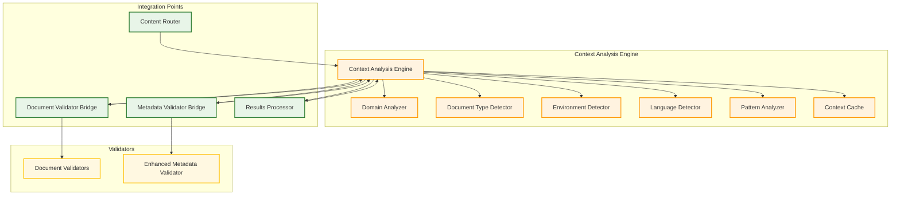
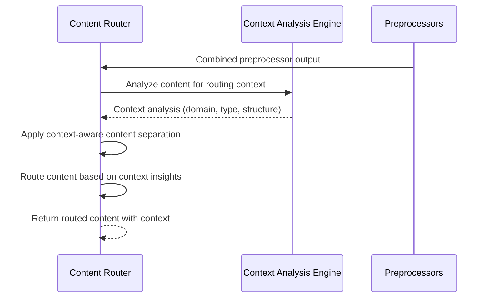
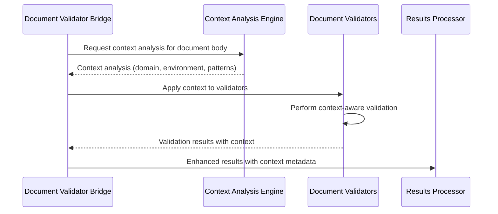
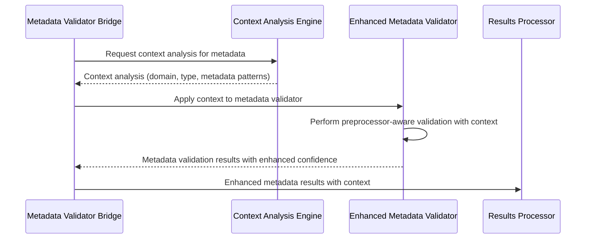
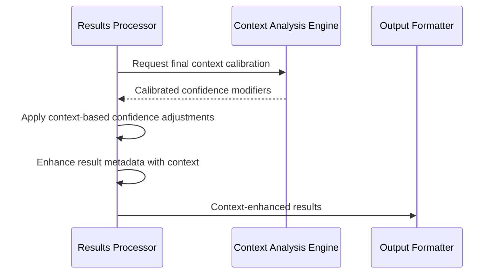

# Context Analysis Engine Integration Points and Data Flow

[← Back to Documentation Index](../README.md)

## Overview

The Context Analysis Engine is a critical component that enhances the accuracy of Ferret Scan's validation system by providing contextual information about documents and their content. This document describes how the Context Analysis Engine integrates with the Content Router and dual-path validation system, including detailed data flow diagrams and integration points.

## Context Analysis Engine Architecture

### Core Components



### Context Analysis Data Structure

```go
type ContextAnalysis struct {
    // Document Identification
    FilePath     string    `json:"file_path"`
    FileType     string    `json:"file_type"`
    DocumentType string    `json:"document_type"`
    
    // Domain Analysis
    Domain           string            `json:"domain"`
    DomainConfidence float64          `json:"domain_confidence"`
    DomainKeywords   []string         `json:"domain_keywords"`
    
    // Environment Detection
    Environment           string   `json:"environment"`
    EnvironmentConfidence float64  `json:"environment_confidence"`
    EnvironmentIndicators []string `json:"environment_indicators"`
    
    // Language Analysis
    Language           string   `json:"language"`
    LanguageConfidence float64  `json:"language_confidence"`
    Locale             string   `json:"locale"`
    
    // Pattern Analysis
    PatternContext    map[string]interface{} `json:"pattern_context"`
    SemanticContext   map[string]interface{} `json:"semantic_context"`
    StructuralContext map[string]interface{} `json:"structural_context"`
    
    // Confidence Modifiers
    ConfidenceModifiers map[string]float64 `json:"confidence_modifiers"`
    
    // Metadata
    AnalysisTimestamp time.Time               `json:"analysis_timestamp"`
    AnalysisVersion   string                  `json:"analysis_version"`
    ProcessingTime    time.Duration          `json:"processing_time"`
    CacheHit          bool                    `json:"cache_hit"`
}
```

## Integration Points

### 1. Content Router Integration

The Content Router integrates with the Context Analysis Engine to inform content separation decisions.

#### Integration Flow



#### Implementation

```go
func (cr *ContentRouter) RouteContentWithContext(
    content *preprocessors.ProcessedContent,
) (*RoutedContent, error) {
    // Get context analysis for routing decisions
    contextAnalysis, err := cr.contextEngine.AnalyzeContent(
        content.CombinedContent,
        content.OriginalPath,
    )
    if err != nil {
        cr.observer.LogWarning("context_analysis_failed", 
            "Context analysis failed, using default routing", 
            map[string]interface{}{
                "file_path": content.OriginalPath,
                "error":     err.Error(),
            })
        contextAnalysis = nil
    }
    
    // Apply context-aware routing
    routedContent, err := cr.routeWithContext(content, contextAnalysis)
    if err != nil {
        return nil, fmt.Errorf("context-aware routing failed: %w", err)
    }
    
    // Attach context to routed content
    routedContent.ContextAnalysis = contextAnalysis
    
    return routedContent, nil
}
```

#### Context-Aware Routing Logic

```go
func (cr *ContentRouter) routeWithContext(
    content *preprocessors.ProcessedContent,
    context *ContextAnalysis,
) (*RoutedContent, error) {
    routedContent := &RoutedContent{
        OriginalPath: content.OriginalPath,
        Metadata:     []MetadataContent{},
    }
    
    // Apply context-specific routing rules
    if context != nil {
        switch context.DocumentType {
        case "resume", "cv":
            // For resumes, prioritize personal information in metadata
            routedContent = cr.routeResumeContent(content, context)
        case "financial_document", "invoice", "statement":
            // For financial documents, apply stricter metadata separation
            routedContent = cr.routeFinancialContent(content, context)
        case "legal_document", "contract":
            // For legal documents, preserve document structure context
            routedContent = cr.routeLegalContent(content, context)
        default:
            // Use standard routing
            routedContent = cr.routeStandardContent(content, context)
        }
    } else {
        // Fallback to standard routing without context
        routedContent = cr.routeStandardContent(content, nil)
    }
    
    return routedContent, nil
}
```

### 2. Document Validator Bridge Integration

The Document Validator Bridge uses context analysis to enhance validation accuracy for document body content.

#### Integration Flow



#### Implementation

```go
func (dvb *DocumentValidatorBridge) ProcessDocumentBody(
    documentBody string,
    originalPath string,
    baseContext *ContextAnalysis,
) ([]detector.Match, error) {
    // Enhance context analysis for document body
    documentContext, err := dvb.contextEngine.EnhanceContextForDocumentBody(
        documentBody,
        originalPath,
        baseContext,
    )
    if err != nil {
        dvb.observer.LogWarning("document_context_enhancement_failed", 
            "Failed to enhance context for document body", 
            map[string]interface{}{
                "file_path": originalPath,
                "error":     err.Error(),
            })
        documentContext = baseContext
    }
    
    var allMatches []detector.Match
    var wg sync.WaitGroup
    matchChan := make(chan []detector.Match, len(dvb.documentValidators))
    
    // Apply context to all document validators
    for _, validator := range dvb.documentValidators {
        wg.Add(1)
        go func(v detector.Validator) {
            defer wg.Done()
            
            // Apply context analysis to validator
            if contextAware, ok := v.(ContextAwareValidator); ok {
                contextAware.SetContextAnalysis(documentContext)
            }
            
            matches, err := v.ValidateContent(documentBody, originalPath)
            if err == nil {
                // Enhance matches with context metadata
                for i := range matches {
                    matches[i] = dvb.enhanceMatchWithContext(matches[i], documentContext)
                }
                matchChan <- matches
            } else {
                dvb.observer.LogError("document_validation_error", err, map[string]interface{}{
                    "validator": v.GetName(),
                    "file_path": originalPath,
                })
                matchChan <- []detector.Match{}
            }
        }(validator)
    }
    
    // Collect results
    go func() {
        wg.Wait()
        close(matchChan)
    }()
    
    for matches := range matchChan {
        allMatches = append(allMatches, matches...)
    }
    
    return allMatches, nil
}
```

### 3. Metadata Validator Bridge Integration

The Metadata Validator Bridge leverages context analysis to provide preprocessor-aware validation with enhanced accuracy.

#### Integration Flow



#### Implementation

```go
func (mvb *MetadataValidatorBridge) ProcessMetadata(
    metadataContent []MetadataContent,
    baseContext *ContextAnalysis,
) ([]detector.Match, error) {
    var allMatches []detector.Match
    
    // Enhance context for metadata validation
    metadataContext, err := mvb.contextEngine.EnhanceContextForMetadata(
        metadataContent,
        baseContext,
    )
    if err != nil {
        mvb.observer.LogWarning("metadata_context_enhancement_failed", 
            "Failed to enhance context for metadata", 
            map[string]interface{}{
                "error": err.Error(),
            })
        metadataContext = baseContext
    }
    
    // Apply context to metadata validator
    if contextAware, ok := mvb.metadataValidator.(ContextAwareValidator); ok {
        contextAware.SetContextAnalysis(metadataContext)
    }
    
    // Process each metadata section with context
    for _, metadata := range metadataContent {
        // Enhance metadata-specific context
        sectionContext := mvb.enhanceContextForMetadataSection(metadata, metadataContext)
        
        matches, err := mvb.metadataValidator.ValidateMetadataContentWithContext(
            metadata,
            sectionContext,
        )
        if err != nil {
            mvb.observer.LogError("metadata_validation_error", err, map[string]interface{}{
                "preprocessor_type": metadata.PreprocessorType,
                "source_file":      metadata.SourceFile,
            })
            continue
        }
        
        // Enhance matches with context metadata
        for i := range matches {
            matches[i] = mvb.enhanceMetadataMatchWithContext(matches[i], sectionContext, metadata)
        }
        
        allMatches = append(allMatches, matches...)
    }
    
    return allMatches, nil
}
```

### 4. Results Processor Integration

The Results Processor uses context analysis for final confidence calibration and result enhancement.

#### Integration Flow



#### Implementation

```go
func (rp *ResultsProcessor) ProcessResultsWithContext(
    matches []detector.Match,
    contextAnalysis *ContextAnalysis,
) ([]detector.Match, error) {
    if contextAnalysis == nil {
        return matches, nil
    }
    
    var enhancedMatches []detector.Match
    
    for _, match := range matches {
        // Apply context-based confidence calibration
        enhancedMatch := rp.applyContextConfidenceCalibration(match, contextAnalysis)
        
        // Add context metadata to match
        enhancedMatch = rp.addContextMetadata(enhancedMatch, contextAnalysis)
        
        enhancedMatches = append(enhancedMatches, enhancedMatch)
    }
    
    return enhancedMatches, nil
}
```

## Context Analysis Components

### 1. Domain Analyzer

Identifies the business domain or subject area of the document.

#### Supported Domains

```go
var SupportedDomains = map[string]DomainConfig{
    "financial": {
        Keywords: []string{"bank", "account", "transaction", "payment", "invoice", "statement"},
        Patterns: []string{`\b\d{4}-\d{4}-\d{4}-\d{4}\b`, `\$\d+\.\d{2}`},
        ConfidenceModifier: 1.2,
    },
    "healthcare": {
        Keywords: []string{"patient", "medical", "diagnosis", "treatment", "prescription", "doctor"},
        Patterns: []string{`\b\d{3}-\d{2}-\d{4}\b`, `DOB:\s*\d{2}/\d{2}/\d{4}`},
        ConfidenceModifier: 1.3,
    },
    "legal": {
        Keywords: []string{"contract", "agreement", "legal", "court", "attorney", "plaintiff"},
        Patterns: []string{`Case No\.\s*\d+`, `\bvs?\.\s+\w+`},
        ConfidenceModifier: 1.1,
    },
    "personal": {
        Keywords: []string{"resume", "cv", "personal", "address", "phone", "email"},
        Patterns: []string{`\b[A-Za-z0-9._%+-]+@[A-Za-z0-9.-]+\.[A-Z|a-z]{2,}\b`},
        ConfidenceModifier: 1.4,
    },
    "corporate": {
        Keywords: []string{"company", "corporation", "business", "employee", "department", "office"},
        Patterns: []string{`Employee ID:\s*\d+`, `Dept:\s*\w+`},
        ConfidenceModifier: 1.1,
    },
    "government": {
        Keywords: []string{"government", "federal", "state", "agency", "department", "official"},
        Patterns: []string{`\bGSA\b`, `\bFEIN:\s*\d{2}-\d{7}\b`},
        ConfidenceModifier: 1.2,
    },
}
```

#### Implementation

```go
func (da *DomainAnalyzer) AnalyzeDomain(content string) (*DomainAnalysis, error) {
    contentLower := strings.ToLower(content)
    domainScores := make(map[string]float64)
    
    // Analyze keyword frequency
    for domain, config := range SupportedDomains {
        score := 0.0
        
        // Keyword analysis
        for _, keyword := range config.Keywords {
            count := strings.Count(contentLower, strings.ToLower(keyword))
            score += float64(count) * 0.1
        }
        
        // Pattern analysis
        for _, pattern := range config.Patterns {
            regex := regexp.MustCompile(pattern)
            matches := regex.FindAllString(content, -1)
            score += float64(len(matches)) * 0.2
        }
        
        domainScores[domain] = score
    }
    
    // Find highest scoring domain
    maxScore := 0.0
    detectedDomain := "unknown"
    for domain, score := range domainScores {
        if score > maxScore {
            maxScore = score
            detectedDomain = domain
        }
    }
    
    // Calculate confidence
    confidence := math.Min(maxScore/10.0, 1.0) // Normalize to 0-1
    
    return &DomainAnalysis{
        Domain:     detectedDomain,
        Confidence: confidence,
        Scores:     domainScores,
    }, nil
}
```

### 2. Document Type Detector

Identifies the specific type of document being processed.

#### Supported Document Types

```go
var SupportedDocumentTypes = map[string]DocumentTypeConfig{
    "resume": {
        Keywords: []string{"experience", "education", "skills", "objective", "references"},
        Patterns: []string{`\b\d{4}\s*-\s*\d{4}\b`, `\b[A-Z][a-z]+\s+University\b`},
        StructuralIndicators: []string{"contact_info_at_top", "section_headers", "bullet_points"},
        ConfidenceModifier: 1.5,
    },
    "invoice": {
        Keywords: []string{"invoice", "bill", "amount", "due", "payment", "total"},
        Patterns: []string{`Invoice\s*#?\s*\d+`, `\$\d+\.\d{2}`, `Due:\s*\d{2}/\d{2}/\d{4}`},
        StructuralIndicators: []string{"line_items", "totals_section", "payment_terms"},
        ConfidenceModifier: 1.2,
    },
    "contract": {
        Keywords: []string{"agreement", "party", "terms", "conditions", "signature", "witness"},
        Patterns: []string{`WHEREAS`, `NOW THEREFORE`, `IN WITNESS WHEREOF`},
        StructuralIndicators: []string{"signature_blocks", "numbered_sections", "legal_language"},
        ConfidenceModifier: 1.3,
    },
    "report": {
        Keywords: []string{"report", "analysis", "findings", "conclusion", "recommendation"},
        Patterns: []string{`\d+\.\s+[A-Z]`, `Figure\s+\d+`, `Table\s+\d+`},
        StructuralIndicators: []string{"executive_summary", "numbered_sections", "references"},
        ConfidenceModifier: 1.1,
    },
}
```

### 3. Environment Detector

Detects whether the document is from development, test, or production environments.

#### Implementation

```go
func (ed *EnvironmentDetector) DetectEnvironment(content string) (*EnvironmentAnalysis, error) {
    contentLower := strings.ToLower(content)
    
    // Development environment indicators
    devIndicators := []string{
        "localhost", "127.0.0.1", "dev.example.com", "development",
        "test@example.com", "john.doe@example.com", "debug", "staging",
    }
    
    // Test environment indicators
    testIndicators := []string{
        "test", "testing", "qa", "quality assurance", "dummy", "sample",
        "example", "placeholder", "mock", "fake",
    }
    
    // Production environment indicators
    prodIndicators := []string{
        "production", "prod", "live", "www.", ".com", ".org", ".net",
        "customer", "client", "real", "actual",
    }
    
    devScore := ed.calculateIndicatorScore(contentLower, devIndicators)
    testScore := ed.calculateIndicatorScore(contentLower, testIndicators)
    prodScore := ed.calculateIndicatorScore(contentLower, prodIndicators)
    
    // Determine environment
    environment := "unknown"
    confidence := 0.0
    
    if devScore > testScore && devScore > prodScore {
        environment = "development"
        confidence = math.Min(devScore/5.0, 1.0)
    } else if testScore > prodScore {
        environment = "test"
        confidence = math.Min(testScore/5.0, 1.0)
    } else if prodScore > 0 {
        environment = "production"
        confidence = math.Min(prodScore/5.0, 1.0)
    }
    
    return &EnvironmentAnalysis{
        Environment: environment,
        Confidence:  confidence,
        Indicators: map[string]float64{
            "development": devScore,
            "test":        testScore,
            "production":  prodScore,
        },
    }, nil
}
```

### 4. Language Detector

Detects the primary language of the document content.

#### Implementation

```go
func (ld *LanguageDetector) DetectLanguage(content string) (*LanguageAnalysis, error) {
    // Use language detection library or implement basic detection
    detector := lingua.NewLanguageDetectorBuilder().
        FromLanguages(lingua.English, lingua.Spanish, lingua.French, lingua.German).
        Build()
    
    language, exists := detector.DetectLanguageOf(content)
    if !exists {
        return &LanguageAnalysis{
            Language:   "unknown",
            Confidence: 0.0,
            Locale:     "unknown",
        }, nil
    }
    
    confidence := detector.ComputeLanguageConfidence(content, language)
    
    return &LanguageAnalysis{
        Language:   language.String(),
        Confidence: confidence,
        Locale:     ld.getLocaleForLanguage(language.String()),
    }, nil
}
```

## Context-Aware Confidence Calibration

### Confidence Adjustment Framework

```go
func (cac *ContextAwareCalibrator) CalibrateConfidence(
    baseConfidence float64,
    matchType string,
    contextAnalysis *ContextAnalysis,
) float64 {
    if contextAnalysis == nil {
        return baseConfidence
    }
    
    calibratedConfidence := baseConfidence
    
    // Apply domain-specific adjustments
    calibratedConfidence = cac.applyDomainAdjustment(
        calibratedConfidence,
        matchType,
        contextAnalysis.Domain,
        contextAnalysis.DomainConfidence,
    )
    
    // Apply document type adjustments
    calibratedConfidence = cac.applyDocumentTypeAdjustment(
        calibratedConfidence,
        matchType,
        contextAnalysis.DocumentType,
    )
    
    // Apply environment adjustments
    calibratedConfidence = cac.applyEnvironmentAdjustment(
        calibratedConfidence,
        matchType,
        contextAnalysis.Environment,
        contextAnalysis.EnvironmentConfidence,
    )
    
    // Apply language-specific adjustments
    calibratedConfidence = cac.applyLanguageAdjustment(
        calibratedConfidence,
        matchType,
        contextAnalysis.Language,
    )
    
    // Ensure confidence stays within valid range
    return math.Min(100.0, math.Max(0.0, calibratedConfidence))
}
```

### Domain-Specific Confidence Adjustments

```go
func (cac *ContextAwareCalibrator) applyDomainAdjustment(
    confidence float64,
    matchType string,
    domain string,
    domainConfidence float64,
) float64 {
    // Define domain-specific adjustments for different match types
    adjustments := map[string]map[string]float64{
        "financial": {
            "CREDIT_CARD":    1.2, // Higher confidence in financial documents
            "SSN":           1.3, // Very high confidence for SSN in financial context
            "BANK_ACCOUNT":  1.4, // Highest confidence for bank accounts
            "EMAIL":         1.1, // Slightly higher for emails
        },
        "healthcare": {
            "SSN":           1.4, // Very high confidence for SSN in healthcare
            "PHONE":         1.2, // Higher confidence for phone numbers
            "EMAIL":         1.2, // Higher confidence for emails
            "ADDRESS":       1.3, // Higher confidence for addresses
        },
        "personal": {
            "EMAIL":         1.4, // Very high confidence for personal emails
            "PHONE":         1.3, // High confidence for phone numbers
            "ADDRESS":       1.4, // Very high confidence for addresses
            "SSN":           1.5, // Highest confidence for SSN in personal docs
        },
        "legal": {
            "SSN":           1.2, // Higher confidence in legal documents
            "ADDRESS":       1.2, // Higher confidence for addresses
            "PHONE":         1.1, // Slightly higher for phone numbers
        },
    }
    
    if domainAdjustments, exists := adjustments[domain]; exists {
        if adjustment, exists := domainAdjustments[matchType]; exists {
            // Apply adjustment weighted by domain confidence
            adjustmentFactor := 1.0 + ((adjustment - 1.0) * domainConfidence)
            return confidence * adjustmentFactor
        }
    }
    
    return confidence
}
```

## Performance Optimization

### Context Caching

```go
type ContextCache struct {
    cache      map[string]*ContextAnalysis
    mutex      sync.RWMutex
    maxSize    int
    ttl        time.Duration
    lastCleanup time.Time
}

func (cc *ContextCache) Get(contentHash string) *ContextAnalysis {
    cc.mutex.RLock()
    defer cc.mutex.RUnlock()
    
    if analysis, exists := cc.cache[contentHash]; exists {
        // Check if cache entry is still valid
        if time.Since(analysis.AnalysisTimestamp) < cc.ttl {
            analysis.CacheHit = true
            return analysis
        }
        // Remove expired entry
        delete(cc.cache, contentHash)
    }
    
    return nil
}

func (cc *ContextCache) Set(contentHash string, analysis *ContextAnalysis) {
    cc.mutex.Lock()
    defer cc.mutex.Unlock()
    
    // Clean up cache if needed
    if len(cc.cache) >= cc.maxSize {
        cc.cleanup()
    }
    
    analysis.CacheHit = false
    cc.cache[contentHash] = analysis
}
```

### Parallel Context Analysis

```go
func (cae *ContextAnalysisEngine) AnalyzeContentParallel(
    content string,
    filePath string,
) (*ContextAnalysis, error) {
    analysis := &ContextAnalysis{
        FilePath:          filePath,
        AnalysisTimestamp: time.Now(),
    }
    
    var wg sync.WaitGroup
    var mutex sync.Mutex
    
    // Domain analysis
    wg.Add(1)
    go func() {
        defer wg.Done()
        domainAnalysis, err := cae.domainAnalyzer.AnalyzeDomain(content)
        if err == nil {
            mutex.Lock()
            analysis.Domain = domainAnalysis.Domain
            analysis.DomainConfidence = domainAnalysis.Confidence
            analysis.DomainKeywords = domainAnalysis.Keywords
            mutex.Unlock()
        }
    }()
    
    // Document type detection
    wg.Add(1)
    go func() {
        defer wg.Done()
        docTypeAnalysis, err := cae.docTypeDetector.DetectDocumentType(content, filePath)
        if err == nil {
            mutex.Lock()
            analysis.DocumentType = docTypeAnalysis.DocumentType
            mutex.Unlock()
        }
    }()
    
    // Environment detection
    wg.Add(1)
    go func() {
        defer wg.Done()
        envAnalysis, err := cae.environmentDetector.DetectEnvironment(content)
        if err == nil {
            mutex.Lock()
            analysis.Environment = envAnalysis.Environment
            analysis.EnvironmentConfidence = envAnalysis.Confidence
            analysis.EnvironmentIndicators = envAnalysis.Indicators
            mutex.Unlock()
        }
    }()
    
    // Language detection
    wg.Add(1)
    go func() {
        defer wg.Done()
        langAnalysis, err := cae.languageDetector.DetectLanguage(content)
        if err == nil {
            mutex.Lock()
            analysis.Language = langAnalysis.Language
            analysis.LanguageConfidence = langAnalysis.Confidence
            analysis.Locale = langAnalysis.Locale
            mutex.Unlock()
        }
    }()
    
    wg.Wait()
    
    analysis.ProcessingTime = time.Since(analysis.AnalysisTimestamp)
    
    return analysis, nil
}
```

## Monitoring and Observability

### Context Analysis Metrics

```go
type ContextAnalysisMetrics struct {
    AnalysisCount        int64
    CacheHitRate         float64
    AverageProcessingTime time.Duration
    DomainDetectionRate  float64
    TypeDetectionRate    float64
    LanguageDetectionRate float64
    ErrorRate            float64
}

func (cae *ContextAnalysisEngine) collectMetrics(
    analysis *ContextAnalysis,
    err error,
) {
    cae.metrics.AnalysisCount++
    
    if err != nil {
        cae.metrics.ErrorRate = float64(cae.errorCount) / float64(cae.metrics.AnalysisCount)
        return
    }
    
    // Update processing time
    cae.updateAverageProcessingTime(analysis.ProcessingTime)
    
    // Update cache hit rate
    if analysis.CacheHit {
        cae.cacheHits++
    }
    cae.metrics.CacheHitRate = float64(cae.cacheHits) / float64(cae.metrics.AnalysisCount)
    
    // Update detection rates
    if analysis.Domain != "unknown" {
        cae.domainDetections++
    }
    cae.metrics.DomainDetectionRate = float64(cae.domainDetections) / float64(cae.metrics.AnalysisCount)
    
    if analysis.DocumentType != "unknown" {
        cae.typeDetections++
    }
    cae.metrics.TypeDetectionRate = float64(cae.typeDetections) / float64(cae.metrics.AnalysisCount)
    
    if analysis.Language != "unknown" {
        cae.languageDetections++
    }
    cae.metrics.LanguageDetectionRate = float64(cae.languageDetections) / float64(cae.metrics.AnalysisCount)
}
```

### Integration Health Monitoring

```go
func (cae *ContextAnalysisEngine) monitorIntegrationHealth() {
    ticker := time.NewTicker(1 * time.Minute)
    defer ticker.Stop()
    
    for range ticker.C {
        // Check integration point health
        cae.checkContentRouterIntegration()
        cae.checkValidatorBridgeIntegration()
        cae.checkResultsProcessorIntegration()
        
        // Log health status
        cae.observer.LogInfo("context_integration_health", 
            "Context analysis integration health check", 
            map[string]interface{}{
                "analysis_count":         cae.metrics.AnalysisCount,
                "cache_hit_rate":        cae.metrics.CacheHitRate,
                "domain_detection_rate": cae.metrics.DomainDetectionRate,
                "error_rate":           cae.metrics.ErrorRate,
            })
    }
}
```

---

*This document describes the Context Analysis Engine integration points and data flow in Ferret Scan's enhanced metadata processing architecture. For implementation details, see the source code in `internal/context/` and related packages.*