# Ferret Application Flow Diagram

[← Back to Documentation Index](README.md)

This document describes the current application flow for Ferret Scan, reflecting the actual implementation as of 2025.

```mermaid
sequenceDiagram
    participant User
    participant CLI as CLI Main
    participant Config as Config Manager
    participant CtxAnalyzer as Context Analyzer
    participant EnhancedMgr as Enhanced Validator Manager
    participant FileRouter as File Router
    participant ParallelProc as Parallel Processor
    participant WorkerPool as Worker Pool
    participant RedactionMgr as Redaction Manager
    participant Suppression as Suppression Manager
    participant Formatter as Output Formatter

    User->>CLI: ferret-scan --file input.pdf --format json --enable-redaction

    Note over CLI: Alternative Flow for Preprocess-Only Mode
    alt Preprocess-Only Mode (--preprocess-only or -p)
        User->>CLI: ferret-scan --file document.pdf --preprocess-only
        CLI->>Config: LoadConfig(configPath)
        Config-->>CLI: Configuration with defaults
        CLI->>FileRouter: NewFileRouter(debug)
        CLI->>FileRouter: RegisterDefaultPreprocessors()
        CLI->>CLI: getFilesToProcess(inputFile, recursive)
        CLI->>FileRouter: CanProcessFile(filePath, enablePreprocessors, false)
        Note over FileRouter: File type filtering with CanContainMetadata()
        FileRouter-->>CLI: Supported files list
        
        loop For each supported file
            CLI->>FileRouter: ProcessFileWithContext(filePath, context)
            alt PDF file
                FileRouter->>FileRouter: PDF text extraction
            else Office file
                FileRouter->>FileRouter: Office text extraction  
            else Image file
                FileRouter->>FileRouter: EXIF metadata extraction
            else Text file
                FileRouter->>FileRouter: Plain text processing
            end
            FileRouter-->>CLI: ProcessedContent{Text, Metadata, ProcessorType}
            CLI->>CLI: Output formatted preprocessed text to stdout
        end
        CLI-->>User: Preprocessed text output (no validation)
    else Normal Validation Mode
        Note over CLI: 1. Parse command line flags and resolve configuration
    CLI->>Config: LoadConfig(configPath)
    Config-->>CLI: Configuration with defaults and profiles
        CLI->>CLI: resolveConfiguration(cfg, profile, flags)
    end

    Note over CLI: 2. Initialize Enhanced Validator Manager with integrated context analysis
    CLI->>EnhancedMgr: NewEnhancedValidatorManager(config)
    EnhancedMgr->>EnhancedMgr: Initialize integrated context analyzer
    EnhancedMgr->>EnhancedMgr: Configure batch processing (100 items/batch)
    EnhancedMgr->>EnhancedMgr: Configure parallel processing (8 workers)
    EnhancedMgr->>EnhancedMgr: Enable context analysis integration
    EnhancedMgr->>EnhancedMgr: Enable cross-validator analysis
    EnhancedMgr->>EnhancedMgr: Enable confidence calibration

    Note over CLI: 3. Register standard validators with enhanced capabilities
    loop For each validator type
        CLI->>EnhancedMgr: RegisterValidator(name, ValidatorBridge)
        Note over EnhancedMgr: Wrap standard validators with enhanced features
    end

    Note over CLI: 4. Create Enhanced Manager Wrapper for unified processing
    CLI->>CLI: Create EnhancedManagerWrapper(enhancedManager)
    Note over CLI: Wrapper provides unified validator interface for parallel processing

    Note over CLI: 5. Initialize File Router and register preprocessors
    CLI->>FileRouter: NewFileRouter(debug)
    CLI->>FileRouter: RegisterDefaultPreprocessors()
    Note over FileRouter: Plain text, text extraction, and specialized metadata preprocessors (image, PDF, Office, audio, video)

    Note over CLI: 6. Initialize Redaction Manager (if enabled)
    alt Redaction enabled
        CLI->>RedactionMgr: NewRedactionManagerWithConfig()
        CLI->>RedactionMgr: RegisterDefaultRedactors()
        Note over RedactionMgr: Plain text, PDF, Office, Image redactors
    end

    Note over CLI: 7. Get files to process and filter supported types
    CLI->>CLI: getFilesToProcess(inputFile, recursive)
    CLI->>FileRouter: CanProcessFile(filePath, enablePreprocessors, enableGenAI)
    Note over FileRouter: Enhanced with CanContainMetadata() for intelligent file type filtering
    FileRouter-->>CLI: Supported files list

    Note over CLI: 8. Initialize Parallel Processor
    CLI->>ParallelProc: NewParallelProcessor(observer)
    ParallelProc->>WorkerPool: NewWorkerPool(workers, observer)

    Note over CLI: 9. Process all files using parallel processing with enhanced manager
    CLI->>ParallelProc: ProcessFilesWithProgress(files, [enhancedWrapper], router, config, redactionMgr, progressCallback)
    
    Note over ParallelProc: Start worker pool and submit jobs
    ParallelProc->>WorkerPool: Start()
    
    loop For each file
        ParallelProc->>WorkerPool: Submit(Job{filePath, validators, config})
        
        Note over WorkerPool: Worker processes job
        WorkerPool->>FileRouter: ProcessFileWithContext(filePath, context)
        Note over FileRouter: File type detection with CanContainMetadata() and GetMetadataType()
        
        alt File needs preprocessing
            FileRouter->>FileRouter: Route to appropriate preprocessor
            alt PDF file
                FileRouter->>FileRouter: PDF text extraction
            else Office file
                FileRouter->>FileRouter: Office text extraction
            else Image file
                FileRouter->>FileRouter: EXIF metadata extraction
            else Text file
                FileRouter->>FileRouter: Plain text processing
            end
            FileRouter-->>WorkerPool: ProcessedContent{Text, Metadata}
        end

        Note over WorkerPool: Run enhanced validation with file type aware routing
        WorkerPool->>ContentRouter: RouteContent(processedContent)
        Note over ContentRouter: File type aware routing using FileRouter.CanContainMetadata()
        Note over ContentRouter: Performance optimization: 20-30% faster for workloads with many plain text files
        alt Plain text file (.txt, .py, .js, .json, .md, etc.)
            ContentRouter->>ContentRouter: Skip metadata content creation (performance optimization)
            ContentRouter-->>WorkerPool: RoutedContent{DocumentBody, Metadata=[]}
        else Metadata-capable file (.jpg, .pdf, .docx, .mp3, .mp4, etc.)
            ContentRouter->>ContentRouter: Create metadata content with GetMetadataType()
            ContentRouter-->>WorkerPool: RoutedContent{DocumentBody, Metadata=[...]}
        end
        
        WorkerPool->>EnhancedMgr: ValidateWithAdvancedFeatures(routedContent, filePath)
        
        Note over EnhancedMgr: Integrated context analysis and validation
        EnhancedMgr->>EnhancedMgr: AnalyzeContext(content, filePath)
        Note over EnhancedMgr: Context analysis active: Domain=Financial, DocType=PDF, DomainConf=1.00
        EnhancedMgr->>EnhancedMgr: PrepareValidationItems(routedContent, filePath, contextInsights)
        
        par Credit Card Validation with Context
            EnhancedMgr->>EnhancedMgr: ValidateWithContext(content, filePath, contextInsights)
            EnhancedMgr->>EnhancedMgr: Apply Luhn algorithm + Financial domain context
        and Email Validation with Context
            EnhancedMgr->>EnhancedMgr: ValidateWithContext(content, filePath, contextInsights)
            EnhancedMgr->>EnhancedMgr: Domain validation + document type context
        and Secrets Validation with Context
            EnhancedMgr->>EnhancedMgr: ValidateWithContext(content, filePath, contextInsights)
            EnhancedMgr->>EnhancedMgr: Entropy analysis + API key patterns + environment context
        and Other Validators with Context
            Note over EnhancedMgr: SSN, Passport, Phone, IP, Person Name, Metadata, Intellectual Property
            Note over EnhancedMgr: All validators receive context insights for enhanced accuracy
        end

        Note over EnhancedMgr: Apply cross-validator analysis and confidence calibration
        EnhancedMgr->>EnhancedMgr: AnalyzeCrossValidatorSignals(results, contextInsights)
        EnhancedMgr->>EnhancedMgr: CalibrateConfidenceScores(results)
        EnhancedMgr-->>WorkerPool: AdvancedValidationResult with context-enhanced matches

        alt Redaction enabled
            WorkerPool->>RedactionMgr: ProcessMatches(filePath, matches, strategy)
            RedactionMgr->>RedactionMgr: Route to appropriate redactor
            RedactionMgr->>RedactionMgr: Apply redaction strategy
            RedactionMgr->>RedactionMgr: Create redacted file in output directory
            RedactionMgr-->>WorkerPool: Redaction results
        end

        WorkerPool-->>ParallelProc: Job result with matches
        ParallelProc->>CLI: Progress callback (completed, total)
    end

    ParallelProc-->>CLI: All matches + processing stats

    Note over CLI: 10. Apply suppressions
    CLI->>Suppression: NewSuppressionManager(suppressionFile)
    loop For each match
        CLI->>Suppression: IsSuppressed(match)
        Suppression-->>CLI: suppressed status + rule
    end
    CLI->>CLI: Separate suppressed and active matches

    Note over CLI: 11. Format and output results
    CLI->>Formatter: Get(format) // text, json, csv, yaml, junit, gitlab-sast
    CLI->>Formatter: Format(matches, suppressedMatches, options)
    
    alt Text format
        Formatter->>Formatter: Create human-readable table with colors
    else JSON format
        Formatter->>Formatter: Create structured JSON with metadata
    else CSV format
        Formatter->>Formatter: Create spreadsheet-compatible CSV
    else YAML format
        Formatter->>Formatter: Create YAML (100% compatible with JSON)
    else JUnit format
        Formatter->>Formatter: Create JUnit XML for CI/CD integration
    end
    
    Formatter-->>CLI: Formatted results

    Note over CLI: 12. Memory security and cleanup
    CLI->>CLI: Clear sensitive data from memory
    CLI->>CLI: Force garbage collection

    Note over CLI: 13. Output results
    alt Output to file
        CLI->>CLI: WriteFile(outputFile, results) with secure permissions
    else Output to stdout
        CLI->>User: Print results to console
    end

    Note over CLI: 14. Export redaction audit log (if enabled)
    alt Redaction enabled and audit log specified
        CLI->>RedactionMgr: ExportAuditLog(auditLogPath)
        RedactionMgr-->>CLI: Audit log exported
    end
```

## Current Architecture Components (2025):

### 1. **CLI Main** (`cmd/main.go`)
- Entry point that orchestrates the entire scanning process
- Handles command line parsing and configuration resolution
- Manages the complete processing pipeline from input to output

### 2. **Configuration System** (`internal/config`)
- YAML-based configuration with profiles and defaults
- Supports all command-line options in configuration files
- Profile-based configuration for different scanning scenarios

### 3. **Enhanced Validator Manager** (`internal/validators`)
- **Integrated Context Analysis**: Built-in context analyzer for document type and domain detection
- **Batch Processing**: Processes validation items in optimized batches (100 items/batch)
- **Parallel Execution**: Coordinates parallel validation across 8 workers
- **Context-Aware Analysis**: All validators receive context insights for enhanced accuracy
- **Cross-Validator Intelligence**: Identifies patterns spanning multiple validator types
- **Confidence Calibration**: Applies domain-specific confidence adjustments and statistical calibration
- **Pattern Learning**: Session-based pattern discovery and correlation analysis

### 4. **Enhanced Manager Wrapper** (`internal/validators`)
- **Unified Validation Interface**: Provides single entry point for all validation compatible with existing parallel processing
- **Context Integration**: Seamlessly integrates context analysis into the validation pipeline
- **Result Aggregation**: Collects and formats results from all validators into standard detector.Match format
- **Backward Compatibility**: Maintains compatibility with existing parallel processing architecture

### 5. **File Router** (`internal/router`)
- Central orchestration system for preprocessor management
- Handles file type detection and routing to appropriate preprocessors
- Supports plain text, PDF, Office documents, and image metadata extraction

### 6. **Parallel Processor** (`internal/parallel`)
- Unified parallel processing system for all files
- Worker pool management with adaptive resource allocation
- Progress tracking and performance metrics

### 7. **Redaction System** (`internal/redactors`)
- Multi-format document redaction (text, PDF, Office, images)
- Multiple strategies: simple, format-preserving, synthetic data
- Maintains original document structure and creates audit trails

### 8. **Suppression Manager** (`internal/suppressions`)
- Rule-based filtering system to reduce false positives
- Hash-based matching for precise finding identification
- Support for temporary and permanent suppressions

### 9. **Output Formatters** (`internal/formatters`)
- **Text**: Human-readable format with colors and confidence levels
- **JSON**: Structured data for APIs and programmatic processing
- **CSV**: Spreadsheet-friendly format for analysis
- **YAML**: YAML format, 100% compatible with JSON structure
- **JUnit**: JUnit XML format for CI/CD integration and test reporting

### 10. **Available Validators** (Non-GenAI)
- **Credit Card**: Luhn algorithm + 15+ card brands + test pattern filtering
- **Email**: Domain validation + context analysis
- **Intellectual Property**: Patents, trademarks, copyrights + internal URL detection
- **IP Address**: IPv4/IPv6 with sensitivity filtering
- **Metadata**: EXIF and document metadata analysis with intelligent file type filtering
- **Passport**: Multi-country formats + travel context analysis
- **Person Name**: Pattern matching with embedded name databases, context-aware confidence scoring
- **Phone**: International format support + cross-validator analysis
- **Secrets**: 40+ API key patterns + entropy analysis + environment detection
- **SSN**: Domain-aware validation + HR/Tax/Healthcare context

## Current Data Flow (2025):

### Phase 1: Initialization
1. **Configuration Loading**: Load YAML config files and apply profiles
2. **Context Analysis Setup**: Initialize context analyzer for enhanced validation
3. **Enhanced Validator Setup**: Configure batch processing, parallel execution, and context integration
4. **File Router Setup**: Register preprocessors for all supported file types
5. **Redaction Setup**: Initialize redaction manager and register redactors (if enabled)

### Phase 2: File Discovery and Filtering
6. **File Discovery**: Get files to process (supports recursive scanning and glob patterns)
7. **File Filtering**: Filter supported file types using file router capabilities
8. **Parallel Processor Setup**: Initialize worker pool with adaptive resource management

### Phase 3: Parallel Processing
9. **Job Submission**: Submit all files as jobs to worker pool
10. **Preprocessing**: Route each file to appropriate preprocessor based on file type
11. **Content Extraction**: Extract text and metadata from all file formats
12. **Context Analysis**: Analyze document type, domain, and semantic patterns
13. **Parallel Validation**: Run all configured validators simultaneously on processed content
14. **Context Application**: Apply context insights and confidence adjustments
15. **Redaction Processing**: Create redacted copies if enabled (inline with validation)

### Phase 4: Results Processing
16. **Result Aggregation**: Collect all matches from parallel processing
17. **Suppression Processing**: Apply suppression rules to reduce false positives
18. **Confidence Filtering**: Filter results by user-specified confidence levels

### Phase 5: Output and Cleanup
19. **Format Selection**: Choose appropriate formatter (text, JSON, CSV, YAML, JUnit, GitLab SAST)
20. **Result Formatting**: Format results according to selected output format
21. **Memory Security**: Clear sensitive data from memory and force garbage collection
22. **Output Generation**: Write results to file or display on console
23. **Audit Trail**: Export redaction audit log if enabled

## Key Architectural Features (2025):

### Enhanced Validation
- **Context-Aware Analysis**: All validators use document and domain context
- **Zero Confidence Filtering**: Automatically excludes matches with 0% confidence
- **Cross-Validator Intelligence**: Pattern correlation analysis across validators
- **Confidence Calibration**: Statistical confidence scoring based on historical performance
- **Environment Detection**: Automatic detection of dev/test/prod environments

### Unified Parallel Processing
- **Consistent Architecture**: Same processing pipeline for single files or large collections
- **Adaptive Resource Management**: Dynamic worker pool sizing based on system resources
- **Progress Tracking**: Real-time progress updates with ETA calculations
- **Performance Metrics**: Comprehensive statistics on processing performance

### Comprehensive Redaction
- **Document-Native Redaction**: Maintains original document structure and formatting
- **Multiple Strategies**: Simple, format-preserving, and synthetic data generation
- **Audit Trail**: Complete compliance logging with integrity verification
- **Parallel Redaction**: Concurrent redaction of multiple files

### Security and Performance
- **Memory Scrubbing**: Secure handling and clearing of sensitive data
- **Path Traversal Protection**: Security validation for all file operations
- **Observability Integration**: Comprehensive monitoring and metrics collection
- **Resource Optimization**: Efficient memory usage and garbage collection

### Output Flexibility
- **Multiple Formats**: Five different output formats for various use cases
- **Structured Data**: Machine-readable formats for integration with other tools
- **Human-Readable**: Color-coded text output with confidence indicators
- **CI/CD Integration**: JUnit XML format for automated testing pipelines

This architecture provides enterprise-grade scanning and redaction capabilities while maintaining complete data privacy and eliminating external service dependencies.
