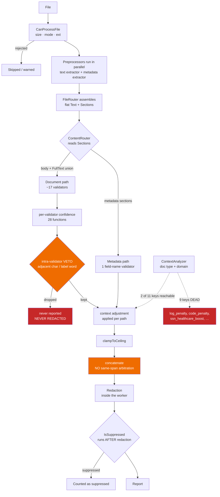
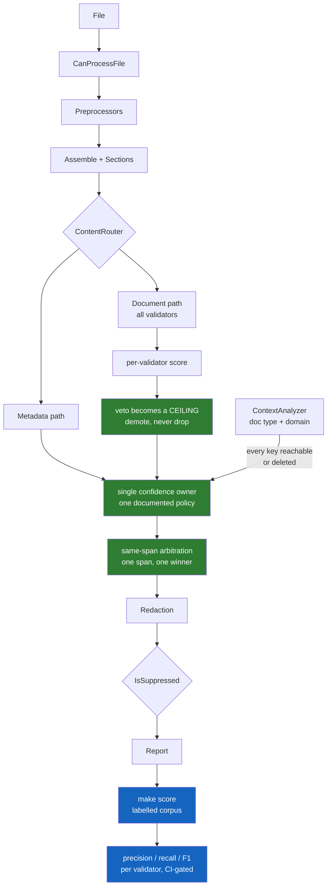

<!--
Copyright Amazon.com, Inc. or its affiliates. All Rights Reserved.
SPDX-License-Identifier: Apache-2.0
-->

# Architecture and plan: detection, confidence, resilience, and scale

Status: proposal, 2026-08-01. Written after the separator-injection program (#236–#241) and
the first two confidence-integrity fixes (#247, #249) landed.

Every claim in this document was measured against `main` unless it is explicitly marked as
a judgement call. Where a number appears, the command that produced it is named.

**Revision note.** The first draft of this document covered only confidence and detection.
It was reviewed with the question "does this take speed, scalability, embedded extraction and
fail-safe validators into account?" — it did not. Sections 2.3 through 2.6 and the resilience
row of the plan exist because of that review, and looking at embedded extraction properly
turned up a previously unknown cleartext leak (section 2.4), which now ranks first in Phase 1.

---

## 1. The pattern behind the bugs

Nearly every defect found in this program was the same structural fault in different
clothing: **a decision made by inspecting untrusted or unrelated data, in a place that had
no business making that decision.**

| Symptom | The decision being made | Was made from |
| --- | --- | --- |
| separator injection (#237) | which validators see this content | document body text |
| part-name evasion (#238) | is there a document body here at all | a case-sensitive literal name |
| path guard (#238) | may I read this file | a path-prefix denylist |
| EXIF false positive (#241) | is this hex string a secret | document-wide context |
| correlation boost (#249) | how confident am I in this finding | **other, unrelated findings** |
| suppression hash (#247) | is this the same finding as before | a score that keeps changing |
| veto oracle (open) | is this really a phone number | the adjacent character |

Seen this way the remaining backlog stops being a list of unrelated tickets and becomes
three coherent programs, plus one missing capability that gates two of them.

---

## 2. Current architecture



Red is broken. Orange is unowned — it works, but nobody decided it should behave this way.

### 2.1 What the red boxes mean

**A vetoed finding escapes redaction.** Redaction happens inside the worker
(`internal/parallel/parallel_processor.go`), and suppression filtering happens after it
(`internal/core/scanner.go:177`). So a *suppressed* finding is still redacted — correct —
but a finding a validator **vetoes** never reaches the redactor at all. Measured on `main`,
same phone number on six lines:

```text
contact 415-555-2671 today     → detected, output reads "contact [PHONE-REDACTED] today"
x415-555-2671 today            → SUPPRESSED, output reads "x415-555-2671 today"
ref-415-555-2671 today         → SUPPRESSED, cleartext in output
session: 415-555-2671 today    → SUPPRESSED, cleartext in output
```

`isPhoneEmbedded` (`internal/validators/phone/validator.go` ~line 1375) vetoes when the
character immediately before the match is alphanumeric, `_` or `-`, or when a governing
label word (`session`, `uuid`, `token`, …) precedes it. All of that is text a document
author chooses, so a real phone number can be hidden — from the report *and* from the
redacted file — by prefixing it with `x`.

Note `session=415-555-2671` does **not** trigger it: `=` is not in the veto set. An earlier
note in this project recorded `=` as the repro, which meant the recorded fixture never
exercised the bug.

**9 of 11 confidence-policy keys are unreachable.** `internal/context/analyzer.go` writes
these adjustment keys:

```text
code_penalty              creditcard_financial_boost   creditcard_healthcare_penalty
creditcard_hr_penalty     log_penalty                  production_boost
ssn_financial_boost       ssn_healthcare_boost         ssn_hr_boost
tabular_boost             test_data_penalty
```

`GetConfidenceAdjustment` reads only `tabular_boost`, `test_data_penalty`, and
`<validatorName>_boost` / `<validatorName>_penalty`. Validator names are lowercase bare
words (`ssn`, `creditcard`, `phone`, `secrets`, …), so the reader looks for `ssn_boost`
while the writer emits `ssn_healthcare_boost`. **The two never meet.**

User-visible consequence, measured on identical data:

| file | SSN | VISA |
| --- | ---: | ---: |
| `t.csv` | **100** | 100 |
| `t.txt` | **60** | 95 |

A **+40 swing on the SSN purely because the file is comma-separated** — that is
`tabular_boost` (+20, applied once per validation path). Meanwhile `log_penalty` and
`code_penalty` never fire, so **log files and source code receive no discount at all**
despite the code saying they should. The tool over-trusts spreadsheets and over-reports on
noisy input, and neither behaviour was chosen.

### 2.2 Scale of the confidence surface

| Measure | Count |
| --- | ---: |
| Go files | 427 |
| test files | 256 |
| validators | 17 |
| confidence mutation sites | **68** across 6 files |
| per-validator confidence functions | **28** |
| veto-shaped functions | ~15 |
| points where confidence is adjusted *after* a validator returns | 3 |

There is no single place that owns what a confidence number means or who may change it.

### 2.3 Speed, scale and resource bounds — mostly present and mostly good

This is the part of the system that has been engineered most deliberately, and the first draft
of this document unfairly ignored it. What exists today:

| Bound | Where | Value |
| --- | --- | --- |
| worker concurrency | `parallel_processor.go:68` | `runtime.NumCPU()` |
| per-file size gate | `file_router.go` `MaxFileSize` | 100 MB |
| non-regular file refusal | `file_router.go` (added #238) | mode check, not a path denylist |
| cumulative extracted text | `office-text-extractor.go` `MaxTotalTextBytes` | 200 MB |
| single embedded item | `office-extractor.go` `MaxEmbeddedMediaSize` | 50 MB |
| live bytes across workers | `execguard.BytesLimiter` via `JobConfig.MaxLiveBytes` | opt-in |
| per-validator time/match budget | `execguard/budget.go`, `firstBudgetError` | opt-in |
| hash line contribution | `suppression.go` `maxHashLineLen` | 8 KB |

The budget design is notably careful: when a per-validator budget fires, the matches gathered
*before* it fired are **kept**, and the scan is flagged incomplete rather than silently
truncated (`dual_path_bridge.go:429`). That is the right trade — partial results plus an
honest signal, instead of either losing findings or hanging.

Two gaps:

- `MaxLiveBytes` and the validator budgets are **opt-in and default off**. So the default
  posture has per-file and per-extraction caps but no global memory ceiling across concurrent
  workers.
- Complexity is guarded by convention (the TEST_PLAN timing dimension) rather than by an
  automated gate. Several O(n²) defects have been found and fixed this way, which shows the
  convention works, but it depends on the person remembering.

### 2.4 Embedded extraction — a cleartext leak, found by asking this question

`.docx`, `.xlsx` and `.pptx` are zip containers, and embedded items under `word/media/` are
extracted and **re-processed through the router** (`BaseMetadataPreprocessor.ProcessEmbeddedMedia`
-> `bmp.router.ProcessFile`). #239 made that path carry declared sections so an embedded
`.wav`'s `Artist:` field routes to the audio rule set rather than the office one.

But the filter on what gets re-processed is only
`strings.Contains(file.Name, "/media/")` — **no extension restriction**
(`office-extractor.go:714`, `:809`). So a `.docx` nested inside a `.docx` is extracted, and
its metadata comes through, but **its body text never reaches the document validators.**

Measured on `main`, innermost body carrying `ssn 449-87-4100`:

| fixture | SSN found? | types reported |
| --- | --- | --- |
| flat `.docx`, SSN in body | yes | SSN |
| `d1.docx` (SSN in body + core props) | yes | SSN, AUTHOR_INFO, PERSON_NAME |
| `d2.docx` (SSN one level in, at `word/media/inner.docx`) | **NO** | AUTHOR_INFO, PERSON_NAME |
| `d3.docx` (two levels) | **NO** | same |

Detection stops at **depth 2**, silently, at exit 0, with the file reported clean.

**The sink confirms it is a leak.** With `--enable-redaction`, the SSN survives in cleartext
inside `word/media/inner.docx` in the redacted output. Note grepping the outer container finds
nothing, because the inner `.docx` is itself compressed inside it — the container-format trap
from the TEST_PLAN, one level deeper than the plan describes.

**And there is no recursion-depth guard anywhere.** Searching for depth/recursion/nesting in
`base_metadata_preprocessor.go` and `file_router.go` returns nothing. That matters for the fix:
naively making recursion work would turn a recall bug into a zip-bomb amplifier. Depth capping
and the body-text fix have to land together.

This ranks **above** the veto leak in Phase 1. The veto needs deliberately crafted adjacent
text; this one needs only a user who embedded a document inside a document.

### 2.5 Fail-safe validators — the strongest part of the design

A validator that panics, hangs or misbehaves must not take the scan down or silently drop
content. What exists:

- **`execguard.SafeRun`** wraps every validator dispatch and recovers panics. Its own comment
  states the reason precisely: Go panics do not cross goroutine boundaries, so the recover has
  to be inside the goroutine that runs the validator.
- **Panic recovery at four layers**: `execguard.go:72`, `worker_pool.go:208`, the PDF text
  extractor (`pdf-text-extractor.go:35`), and inside individual validators
  (`intellectualproperty`, `socialmedia`).
- **Preprocessor panics are contained per-preprocessor** in `file_router.go`'s parallel fan-out,
  so one bad extractor does not lose the others' output.
- **Degraded coverage is reported, not hidden**: `ValidationError` feeds `incompleteFiles`,
  which feeds `--fail-on-incomplete` (exit 3). #238 extended the same mechanism to unreadable
  files and empty extractions.
- **Graceful degradation is biased safely** in routing: when the router cannot parse structure
  it assigns the *whole* text to the document body, so a parse failure over-scans rather than
  under-scans.

The one hole is the subject of section 2.2: a validator's own **veto** bypasses all of this. A
panic is caught, a timeout is reported, a routing failure fails safe — but a validator quietly
deciding "not mine" produces no error, no warning, and no redaction. It is the only failure
mode in the system that is both silent and lossy.

### 2.6 What the diagram omits

For honesty, the diagrams in sections 2 and 3 are the *logical* pipeline. They do not show the
worker pool, the budget/limiter wrapping, panic recovery, or the embedded-media re-entry into
the router. Those are real and load-bearing; they are described above rather than drawn, to
keep the diagrams readable.

---

## 3. Proposed architecture



Green is the fixes. **Blue is the missing capability** — the thing that tells you whether
any of the green actually helped.

### 3.1 The four rules the green boxes encode

1. **A finding's score depends on the finding** — not on other findings, not on the rest of
   the file. (#249 established this for one boost; it should hold generally.)
2. **A validator's judgement may cap or demote, never silently delete** — because deletion
   escapes redaction. The mechanism already exists: `ConfidenceCeilingKey` and
   `clampToCeiling` in `internal/validators/dual_path_bridge.go`, built for #241.
3. **Every written adjustment must be read.** A policy key that cannot be reached is a lie
   about behaviour.
4. **Score is not identity.** Already true as of #247.

---

## 4. The missing capability

**There is no labelled corpus in this repository, and therefore no way to measure detection
quality.**

The golden corpus is explicit about this in its own header
(`internal/goldencorpus/corpus.go`):

> The purpose is NOT to assert that any particular detection is "correct" — it is to assert
> that detection, confidence scoring, output formats, and redaction do not CHANGE.

That is a regression net, and a good one. But it locks in whatever the tool does today,
correct or not. A search for any labelled dataset — input plus expected findings — returns
nothing outside `testdata/golden`.

The consequences are visible throughout this session's work:

- #241's EXIF fix could only be justified by hand-reasoning that an `ImageUniqueID` is not a
  secret. No number confirmed it.
- The 9 dead adjustment keys sat unreachable indefinitely, because nothing measured whether
  they helped.
- `tabular_boost` applies **+40** to an SSN in a CSV. Nobody chose that, and no measurement
  says whether it is right.
- An 860-case benchmark referenced in project notes lives **outside** the repository, so it
  cannot gate anything.

### 4.1 What to build

A labelled corpus and a scoring harness, in-repo, gating CI:

- **Labelled cases**: input plus expected findings (type and span). Every case states what
  *should* be found, so a miss and a spurious hit are both failures.
- **Negative cases are the point** — the FP half. Log lines, source code, version strings,
  GUIDs, resource identifiers (`ami-050451375729`), git SHAs. Inputs that must produce
  nothing.
- **`make score`** printing precision, recall and per-validator F1, with a threshold so a
  change that improves recall while wrecking precision fails.
- Seed it from what has already been measured: the EXIF GUID, the phone veto trigger set,
  the NPI/PHONE same-span overlap, the CSV/TXT asymmetry, the fictional-555 range.

### 4.2 Honest costs

- **Labelling is the real work**, and it is mostly careful judgement about what each fixture
  should yield. A mislabelled case bakes a wrong answer in as ground truth, so this is not
  safe to fully delegate.
- **The first baseline will look unflattering.** That is the value, but expect it.
- **No user-visible improvement on day one.**
- **Real customer documents cannot go in the repo.** The corpus is synthetic plus public
  data, so it will under-represent messy reality. Public datasets have already exposed a
  tabular-SSN bypass and 298 city names scored as `PERSON_NAME` — that class of finding
  needs real files, so the harness complements scanning real documents rather than
  replacing it.

---

## 5. Plan: split the backlog by whether it needs measurement

The backlog is not one kind of thing. Some items are decidable now; the rest are
unanswerable without the corpus.

> **Status as of 2026-08-02.** This document was written before the current round of PRs. What
> has changed since, so the table below is not read as still-current:
>
> | Plan item | Status |
> | --- | --- |
> | 4 — `reported ≠ redacted` | **Root-caused and fixed** (PR #250). `ResolveOverlaps` compared match offsets across *different source texts*, because an Office package numbers lines per part; a metadata match silently dropped a body SSN from redaction. |
> | 2 — veto → demote | Mechanism exists (`ConfidenceCeilingKey`, 2 call sites) but is **not applied to the veto sites**. Still open, still unsized. |
> | 3 — 9 dead adjustment keys | **Still open**; 4 of them remain in `internal/context/analyzer.go`. |
> | 6 — `TestGoldenRedact` / `FileCases` | **Still open**; zero redaction references in the `FileCases` path. |
> | 1 — nested container depth 2 | **Still open**, and there are still *zero* depth references in `base_metadata_preprocessor.go`, so the depth-cap warning in the table below stands. |
> | 5, 7 — `docProps/custom.xml`, default-on ceiling | Still open. |
> | 8 — housekeeping | `.perfbase/` is still not gitignored. |
>
> Two Phase 2 corrections, both learned by measuring rather than reasoning:
>
> - The **complexity gate this plan proposes already existed** (18 validator targets, non-vacuity
>   floors, ratio ceilings). The real gap was coverage *past the validator boundary* — redaction
>   and extraction targets were added in PRs #252 and #254. See §7.
> - A **ratio-based** timing assertion does not work for redaction: measured growth before and
>   after a real fix *overlaps* (12.6–13.7× vs 10.0–13.2×), so the assertion there is an absolute
>   ceiling and is documented as a regression backstop, not a proof of linearity.
>
> Work found since, not in the plan below: an extraction quadratic (#254), an empty file reported
> as unreadable (#256), and — worst of the three — a file whose preprocessors all fail
> **vanishing from the scan entirely**: not processed, not skipped, no warning, exit 0 even under
> `--fail-on-incomplete` (issue #257). That last one is the same silent-and-lossy class §1 is
> about, and it belongs in Phase 1.

### Phase 1 — correctness fixes (no measurement required)

These have one right answer regardless of what any benchmark says. Small PRs, each based on
`main`. Ordered by severity: a silent lossy failure outranks a noisy one.

| # | Item | Why it needs no corpus |
| --- | --- | --- |
| 1 | **nested container body text unscanned** (2.4) | Cleartext leak at exit 0, no attacker required — a document embedded in a document. Must land with a recursion-depth cap so the fix is not a zip-bomb amplifier, and with a warning reusing #238's empty-extraction plumbing. |
| 2 | **veto → demote instead of drop** (2.2) | The sink rule decides it: a dropped finding escapes redaction. A leak whatever the F1 says. Reuse the #241 `ConfidenceCeilingKey` mechanism. Size unknown — only the phone validator has been audited; ~14 other veto sites are unassessed. |
| 3 | **delete the 9 unreachable adjustment keys** (2.2) | Code that claims to apply a policy and does not is wrong either way. Deleting is safe; *re-adding* them deliberately is a Phase 3 question. |
| 4 | `reported ≠ redacted` at exit 0 | Findings reported, output written, every match logs `match_redaction_failed`. Silent and lossy. |
| 5 | `docProps/custom.xml` property-value vector | Last open injection surface. |
| 6 | `TestGoldenRedact` cannot cover `FileCases` | `pkg/redact` is in-memory single-content; container cases have no golden redaction coverage — which is how 2.4 stayed hidden. |
| 7 | default-on resource ceiling (2.3) | `MaxLiveBytes` and validator budgets are opt-in; consider a safe default so the shipped posture has a global memory bound. Judgement call on the value, not on whether to have one. |
| 8 | housekeeping | `.gitignore` for `.perfbase/`, stale branches, ship `fix/fake-value-hardcap`. |

Items 1, 2, 4 and 6 are all the same shape — **silent, lossy failure** — and 6 is the test-gap
that let 1 hide. Worth fixing 6 early so the others get golden coverage as they land.

Estimated: 1–2 days, dominated by item 2 if the other veto sites share the phone shape.

### Phase 2 — build the scoring harness

Start small: 40–60 labelled cases weighted toward negatives, `make score`, publish the
baseline.

Include **structural** cases alongside value cases, because section 2.4 shows the expensive
misses are structural rather than pattern-matching failures: a nested container, a
non-conventional part name, a metadata-only file, an embedded item whose type differs from its
container. Those cost far more recall than any regex refinement, and a corpus of only
`ssn-in-a-line` fixtures would have scored 100% while the depth-2 leak sat there.

Add a **complexity dimension** too, so the timing discipline in the TEST_PLAN becomes an
automated gate rather than a convention: fixture families at N/2N/4N with an assertion that the
ratio stays near-linear. Several O(n²) defects were caught by hand this way; a gate makes that
repeatable.

### Phase 3 — the measured decisions

Each of these is currently a coin flip. Deciding them by judgement is how `tabular_boost
+40` and the 9 dead keys got here.

| Item | The question only a corpus answers |
| --- | --- |
| `tabular_boost` +40 | is it earning its keep, or over-trusting CSVs? |
| re-add doc-type / domain policy | do `log_penalty` and `code_penalty` actually improve precision? |
| same-span arbitration policy | specificity-wins or confidence-wins — which scores better? |
| co-occurrence reranker | does proximity scoring improve F1 at all? |
| veto trigger sets | which triggers suppress FPs, and which kill recall? |

### 5.1 Why not corpus-first

The veto leak is live and leaks cleartext today. Fixing it needs no measurement. Building
infrastructure while a known leak sits in `main` is the wrong order.

### 5.2 Why not finish-everything-first

Four Phase 3 items are genuine coin flips. Doing them now means encoding one person's
judgement as if it were fact — the exact process that produced the defects in section 1.

---

## 6. Recommendation

**Phase 1, then Phase 2, then Phase 3 measured.** Concretely: the nested-container leak first
(it is a live cleartext leak needing no attacker), then the veto fix, then dead-key deletion and
the remaining security follow-ups; then the labelled corpus and `make score`; then work the rest
in whatever order the numbers say matters.

If a visible improvement is wanted sooner, the document-type item is the strongest single
candidate — the `+40` on CSVs and the absent discount on logs are both real and measured —
but the *shape* of that fix should still wait for the harness, because "wire the keys up" and
"delete them" are opposite answers and only measurement distinguishes them.

### 6.1 What this review changed

Worth recording, because it generalises. The first draft of this document was confidence-centric
and treated resilience and extraction as out of scope. Reviewing it against speed, scalability,
embedded extraction and fail-safety produced two substantive corrections:

- **The resilience story is better than the draft implied.** Panic recovery at four layers,
  `execguard.SafeRun` with a correct explanation of why recovery must be inside the goroutine,
  budgets that keep partial results and flag incomplete rather than truncating silently, and
  routing that fails safe by over-scanning. That work deserved describing, not omitting.
- **The extraction story is worse.** Taking "we extract images and other things from documents"
  seriously produced a fixture nobody had built — a `.docx` inside a `.docx` — and it leaks
  cleartext at exit 0. It went straight to the top of Phase 1.

The lesson for the plan: this system's most expensive defects are at **seams** — router to
validator, container to embedded item, validator to redactor — not inside any one component.
Both the separator-injection program and this leak were seam defects. Future review effort is
better spent enumerating seams than deepening any single component.

---

## 7. Process notes worth keeping

- **Every PR's base is `main`.** Never chain PR bases. Merging one PR deleted the branch
  another was based on, which auto-closed that PR unreopenably and caused a later PR to
  merge into a branch instead of `main` — for a while three PRs read "MERGED" while `main`
  contained none of the security fix. Sequential merges are fine; chained *bases* are not.
- **Verify content on `main`, not PR state.** "MERGED" only means merged into *its base*.
  Check with `git cat-file -e origin/main:<file>` and grep `main` for a symbol the PR adds.
- **`make vet` covers all three platforms** and `make test-compile-all-platforms`
  cross-compiles the test binaries. `GOOS=windows go build` does **not** compile `_test.go`
  files, which is how a `syscall.Mkfifo` reference behind a runtime `GOOS` check reached CI.
- **Adversarial verification earns its cost.** It caught a fix that was a no-op on
  first-line markers, a regression that silently re-attributed real embedded-media findings,
  and two overstated claims in a PR description.
